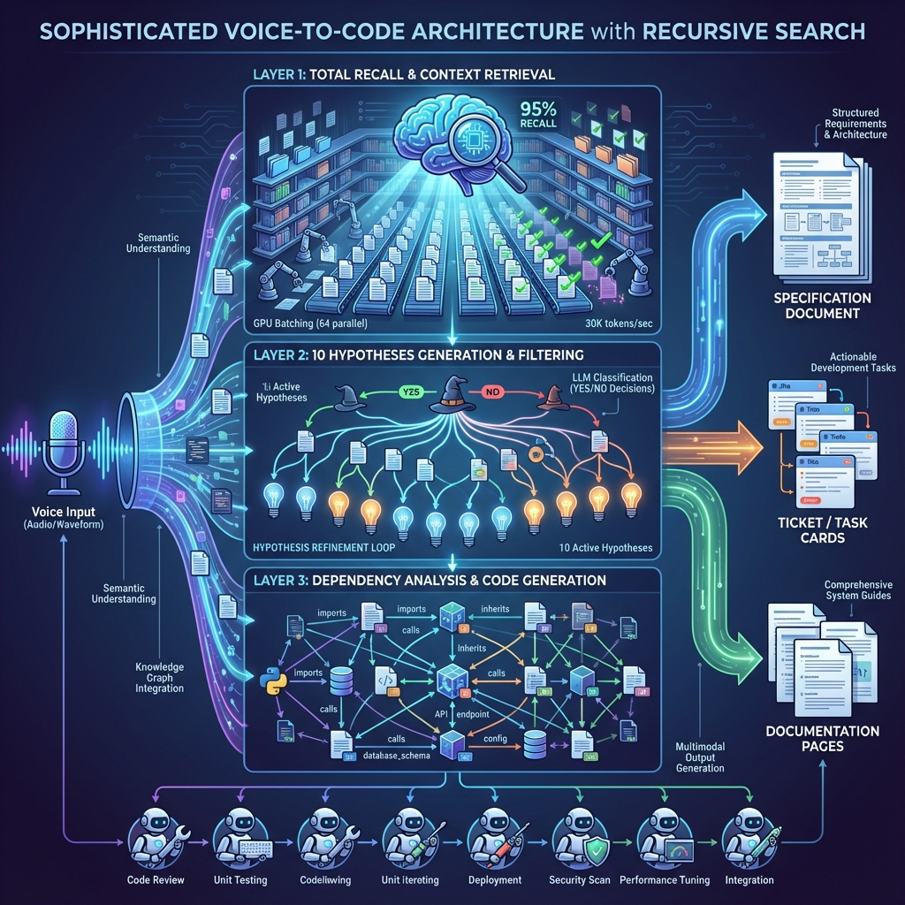

# NSS Coder — AI-First Documentation & Automation System

**NSS** = **N**euro **S**ymbolic **S**emiotic

> **Philosophy**: In the AI programming era, documentation is more important than code. This system serves as both AI memory and human reference.

---



## 🎯 What is This?

**NSS Coder** is a standalone documentation automation system designed for **dual consumption**:

### For AI Agents
- **Active Execution**: Run the automation scripts, not just read about them
- **Perfect Memory**: Complete understanding of project architecture and dependencies
- **Context Retrieval**: Run `assemble_context.py` to get task-specific context
- **Refactoring Safety**: Run `analyze_dependencies.py` to check impacts
- **Validation**: Run `validate_docs.py` to verify your work

### For Humans
- **Navigation**: Clear roadmap through complex codebase
- **Onboarding**: New developers can understand the system quickly
- **Maintenance**: Easy to find and fix issues
- **Knowledge Transfer**: Institutional knowledge preserved

---

## 🚀 Quick Start

**New to this project?** Start here:

1. **Constitution**: [GEMINI.MD](GEMINI.MD) — required reading
2. **Automation**: [automation/README.MD](automation/README.MD) — core tools
3. **Agent Guide**: [AGENT_ONBOARDING.md](AGENT_ONBOARDING.md) — AI workflow
4. **Run Tests**: `python3 automation/test_system.py -p 1`

### Essential Commands

```bash
# Analyze dependencies for a file
python3 automation/analyze_dependencies.py --target path/to/file.py

# Assemble AI context for a task
python3 automation/assemble_context.py --task "implement feature X"

# Search documentation
python3 automation/semantic_search.py --query "your search term"

# Validate documentation
python3 automation/validate_docs.py

# Full system validation
python3 automation/validate_system.py -p 3
```

---

## 📁 Project Structure

```
nss_coder/
├── GEMINI.MD                    # Project constitution & AI rules
├── README.MD                    # This file
├── AGENT_ONBOARDING.md          # AI agent quick start guide
├── requirements.txt             # Python dependencies
│
├── automation/                  # Core automation toolkit (20+ scripts)
│   ├── README.MD               # Detailed automation guide
│   ├── *.py                    # Python automation scripts
│   ├── *.pseudo.md             # Pseudocode specifications
│   ├── *.mmd                   # Mermaid diagrams
│   ├── voice_*.py              # VoicePal voice interface
│   └── neuro_semantics/        # 🧠 EEG/BCI Research
│
├── docs/                        # Documentation system
│   ├── specs/                  # Formal specifications
│   ├── wiki/                   # Human-readable guides
│   ├── diagrams/               # Visual documentation
│   ├── developer_diary/        # Development logs
│   ├── deep_research/          # Research findings
│   └── memory/                 # AI memory system
│       ├── embeddings/         # Vector embeddings
│       ├── knowledge_graph/    # Project knowledge graph
│       └── indexes/            # Fast lookup indexes
│
├── utils/                       # Shared utilities
│   ├── docs_logger.py          # Paranoid logging
│   ├── docs_dual_memory.py     # Dual-index embeddings
│   └── docs_config.py          # Configuration loader
│
├── config/
│   └── docs_config.yaml        # LLM & embedding settings
│
└── future_dev/                  # Philosophy & future development
    └── philosophy_eng.md       # Translated philosophy document
```

---

## 🛠️ Automation Scripts

| Script | Purpose | Quick Command |
|--------|---------|---------------|
| `search_by_tag.py` | Find by `<!--TAG:-->` | `--list-tags` |
| `analyze_dependencies.py` | 5-layer deps | `--target file.py` |
| `search_dependencies.py` | Graph + cycles | `--file X.py --reverse` |
| `semantic_search.py` | Keyword/semantic | `"query" --mode hybrid` |
| `assemble_context.py` | AI context | `--task "description"` |
| `chunk_documents.py` | 3-layer RAG | `--input-dir docs` |
| `index_project.py` | Embeddings + graph | `--build-all` |
| `generate_call_graph.py` | Call graphs | `--file X.py --with-metrics` |
| `validate_docs.py` | Check links | `--report report.md` |
| `validate_system.py` | Multi-tier | `-p 5` (paranoia) |
| `ast_auto_tagger.py` | Auto-tags | `--all --preview` |
| `tag_validator.py` | Validate tags | `--all --fix` |
| `test_system.py` | Two-layer tests | `-p 5 -v` |

See [automation/README.MD](automation/README.MD) for detailed documentation.

---

## 🖥️ NSS-Spec IDE: 10-Stage Specification Generator

Located in `automation/nss_spec_ide.py` — browser-based IDE for spec-first development.

**10 Stages:**
1. 🔮 **Deep Context** — Problem, ecosystem, edge cases
2. ❓ **True Needs** — 5 Whys, JTBD, User Stories
3. 🧠 **Philosophy** — Deep Research, Build vs Buy
4. 🏛️ **Architecture** — Components, patterns, diagrams
5. 🖥️ **UI/CLI Design** — Wireframes, CLI commands
6. 📋 **Tech Spec** — Requirements, API, edge cases
7. 🎫 **Holographic Tickets** — ~700 token cognitive units
8. 💻 **Pseudocode** — 80-90% semantic glue (comments)
9. ✅ **Verification** — TDD, Integration, Adversarial AI
10. 🚀 **Handoff** — Package for coding agent

**Key Concepts:**
- **Cognitive Units** (~700 tokens) — 1M steps without errors
- **Holographic Principle** — 10% → 80% restoration
- **Bidirectional Storytelling** — Business ↔ Hardware
- **Token Gravity** — Smart words attract smart tokens

---

## 🎤 VoicePal v3: Voice-to-Specification System

Located in `automation/voice_*.py` — revolutionary voice-first development system.

**Innovation Score:** 9.2/10 (Exceptional)

**Key Innovations:**
1. **Total Recall** — LLM binary classification of ALL files (no embeddings needed!)
2. **Hypothesis-Driven Search** — 10 AI-generated interpretations of your intent
3. **Zero Embeddings** — Instant start, no indexing required
4. **8x Faster** — 10 min voice workflow vs 90 min traditional

**Performance:**
- 30,000 tokens/sec throughput
- 64 parallel requests via vLLM batching
- 95-100% recall (vs 70-80% for embeddings)

---

## 🧠 Neuro-Semantics: EEG/BCI Research

Located in `automation/neuro_semantics/` — research project for **mind-reading IDE integration**.

**Goal:** 99% understanding of programmer intent without verbalization

**Hardware:** Muse Headband (EEG + PPG/NIRS)

**Paradigm:** "EEG + Context → Mental Model" instead of "EEG → Text"

**Key Files:**
- `PROJECT_MANIFEST.md` — Architecture & vision
- `DEEP_RESEARCH_*.md` — Research findings (6 iterations)
- `MVP_DATA_COLLECTION_INDEX.md` — Data collection plan
- `PHILOSOPHY.md` — Paradigm shift explanation

**Research Stack:**
- EEGPT, LaBraM, NeuroLM — EEG foundation models
- DeWave, EEG2TEXT — EEG-to-text SOTA
- muselsl, amused-py — Muse Python libraries

---

## 🏗️ Django Migration Plan (Future)

Located in `nss_django/` — plan for migrating prototypes to production Django.

**Status:** Planned (6-week timeline)

**Architecture:** Django wraps existing CLI scripts (don't touch working code!)

**Phases:**
1. **Week 1:** Django project setup, Docker Compose (Redis, PostgreSQL)
2. **Week 2-3:** Core apps (voice, brain, search, memory)
3. **Week 4-5:** WebSocket layer (Channels, Celery)
4. **Week 6:** Frontend (HTMX or Vue 3)

**Key Principle:** Django apps wrap existing scripts as services:
- `apps.voice` → `voice_whisper_fast.py`, `voice_processor.py`
- `apps.brain` → `docs_llm_backend.py`
- `apps.search` → `semantic_search.py`, `search_by_tag.py`
- `apps.memory` → `index_project.py`, `chunk_documents.py`

---

## 📚 Documentation Layers

We document **five interconnected layers**:

| Layer | Description |
|-------|-------------|
| **Code** | Imports, function calls, class inheritance, exports |
| **Configuration** | YAML/JSON files, environment variables, CLI args |
| **Data** | Input/output files, intermediate data, transformations |
| **External** | API calls, external services, system commands |
| **Orchestration** | Execution order, conditional logic, entry points |

---

## 📖 Documentation Philosophy

> **Every task MUST begin and end with documentation work.**

### Core Rules:
1. **Documentation Before Code** — Never code without reading docs first
2. **Every Line Commented** — "Vectorial sugar & semantic glue"
3. **Semantic Tags** — Use `<!--TAG:name-->` for line-shift resistant refs
4. **Paranoid Logging** — Log every significant action
5. **5-Layer Dependencies** — Track code, config, data, external, orchestration

---

## 📚 Research Findings (Military-Grade + AI-First)

**Hybrid Architecture:**
- **Military-grade rigor** — MIL-STD-498, DO-178C, NASA-STD-2100
- **AI-first optimization** — semantic chunking, vector embeddings, knowledge graphs
- **Living documentation** — automated updates, drift detection

**15 Research Areas:**
1. Military & Aerospace Standards
2. AI-First Documentation Architecture
3. Automated Dependency Extraction
4. Living Documentation Systems
5. Knowledge Graph for Code
6. Documentation-Driven Development
7. Multi-Format Documentation
8. Developer Diary & Decision Logs
9. Technical Debt Tracking
10. Documentation Automation Tools
11. AI Agent Integration Patterns
12. Documentation for LLM-Heavy Projects
13. Cross-Referencing & Linking
14. Documentation Search & Discovery
15. Emergency & Security Procedures

**Rarity Assessment:** Top 1% of documentation systems (comparable to Google, NASA, Kubernetes)

---

## 🤖 AI Agent Prompts

### THE SUPREME LAW: Project Tools > Internal Tools

| Your Goal | ❌ DON'T USE | ✅ MUST RUN |
|-----------|--------------|-------------|
| Get Context | `view_file` (reading many files) | `python3 automation/assemble_context.py --task "TASK"` |
| Search Code | `grep_search` | `python3 automation/search_by_tag.py --tag TAG_NAME` |
| Check Dependencies | Manually reading imports | `python3 automation/search_dependencies.py --file PATH` |
| Validate Work | Assumptions | `python3 automation/validate_docs.py --report /tmp/report.md` |
| Research | Internal Knowledge | Web Search (5-10 queries minimum!) |

### Workflow Phases

**PHASE 1: BEFORE CODING**
```bash
# Assemble context for your task (ALWAYS RUN THIS FIRST!)
python3 automation/assemble_context.py --task "YOUR TASK HERE"
```

**PHASE 2: CODING**
- Follow specs from `docs/specs/`
- Comment EVERY line (Vectorial Sugar)
- Use Paranoid Logging

**PHASE 3: AFTER CODING (NON-NEGOTIABLE!)**
```bash
# Regenerate dependencies for modified files
python3 automation/analyze_dependencies.py --target path/to/modified_file.py

# Validate all documentation
python3 automation/validate_docs.py --report /tmp/validation.md
```

### Documentation Update Checklist
- [ ] Update `docs/specs/` if behavior/API changed
- [ ] Update `docs/wiki/` if concepts changed
- [ ] Log in `docs/developer_diary/` (what was done and WHY)
- [ ] Update `docs/technical_debt/` if shortcuts were taken
- [ ] If new tool created, add to `GEMINI.MD` and `SYSTEM_PROMPT.md`

---

## 🔧 Utilities API

### DocsLogger

```python
from utils.docs_logger import DocsLogger

logger = DocsLogger("my_script")
logger.info("Message")
logger.error("Error", {"context": "value"})
logger.log_step("step_name", "COMPLETED", duration=1.5)
```

### DocsConfig

```python
from utils.docs_config import docs_config

endpoint = docs_config.get("llm.vllm_endpoint", "http://localhost:8000")
model = docs_config.get("embeddings.model")
```

### DocsDualMemory

```python
from utils.docs_dual_memory import DocsDualMemory

memory = DocsDualMemory()
results = memory.unified_search("query", top_k=10)
```

### DocsLLMBackend

```python
from utils.docs_llm_backend import DocsLLMBackend

llm = DocsLLMBackend()
response = llm.generate("system prompt", "user prompt")
```

---

## 📦 Portability

This system can be copied to any location:

```bash
# Copy to new project
cp -r nss_coder/ /new/location/
cd /new/location/nss_coder

# Install dependencies
pip install -r requirements.txt

# Test
python3 automation/search_by_tag.py --list-tags
```

---

## 🔄 Common Workflows

```bash
# Onboarding: analyze + index
python3 automation/analyze_dependencies.py --all
python3 automation/index_project.py --build-all

# Before changes: understand deps
python3 automation/search_dependencies.py --file target.py --reverse

# After changes: validate
python3 automation/validate_system.py -p 3
```

---

## ⚙️ Configuration

Edit `config/docs_config.yaml`:

```yaml
llm:
  backend: "vllm"
  vllm_endpoint: "http://localhost:8000/v1/chat/completions"
  model_name: "qwen3-coder-30b"

embeddings:
  backend: "sentence_transformers"
  model: "all-MiniLM-L6-v2"

logging:
  level: "INFO"
  console_output: false
```

---

## 🔗 Key Documentation

| File | Purpose |
|------|---------|
| [GEMINI.MD](GEMINI.MD) | Complete AI agent constitution |
| [AGENT_ONBOARDING.md](AGENT_ONBOARDING.md) | AI agent quick start |
| [automation/README.MD](automation/README.MD) | Automation tools guide |
| [STANDALONE_SETUP.md](STANDALONE_SETUP.md) | Portable setup guide |

---

**Version:** 4.0  
**Last Updated:** 2026-01-08  
**Status:** Active Development
