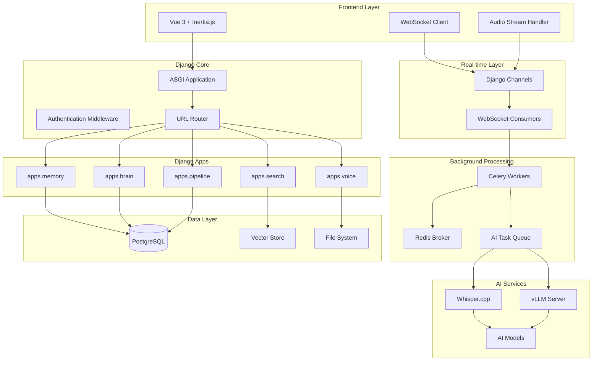
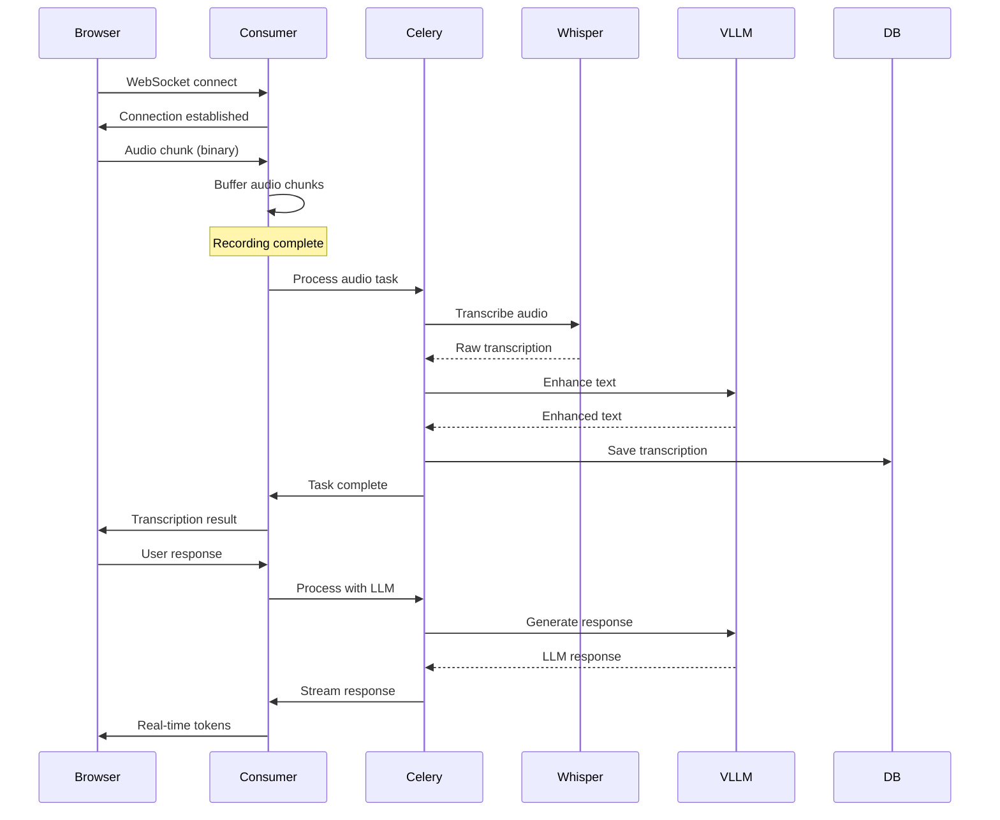

# Web Framework Architecture for Local AI
Created at 2025-12-14 13:50:25 UTC

> @ 2025-12-14 13:50:25 UTC
>
> # Deep Research Request: Web Framework Architecture for Local AI Operating System
> 
> **Target Agent Role:** Senior Full-Stack Architect with expertise in Django ecosystem, Real-time systems, and AI infrastructure.
> 
> ---
> 
> ## 1. Executive Summary (What is NSS?)
> 
> **NSS (Neuro-Symbolic System)** is a **local-first AI Operating System for developers**. It's a collection of Python scripts that form an intelligent memory, search, and code analysis pipeline — all running locally on GPU hardware (no cloud APIs).
> 
> **The Vision:** An AI-native development environment where:
> - Voice becomes the primary input modality
> - LLMs analyze, search, and generate code based on total project understanding
> - Every script, spec, and document is indexed and semantically searchable
> - Multi-agent orchestration handles complex tasks through 10-stage pipelines
> 
> **Current State:** We have ~20 Python scripts in `docs/automation/` that work as CLI tools. They need a **unified Web UI** to become an actual "IDE" experience.
> 
> ---
> 
> ## 2. Core Subsystems (Scripts That Need Web Integration)
> 
> ### A. Memory & Indexing Layer
> | Script | Purpose | Key Capabilities |
> |--------|---------|------------------|
> | `index_project.py` | Vector embeddings + Knowledge Graph builder | sentence-transformers, vLLM embeddings, AST parsing |
> | `chunk_documents.py` | Semantic document chunking | RAG-ready chunks with metadata |
> | `docs_dual_memory.py` | Unified vector search interface | Dual-index (descriptions + code), FAISS-like |
> 
> ### B. Search & Context Assembly Layer
> | Script | Purpose | Key Capabilities |
> |--------|---------|------------------|
> | `semantic_search.py` | Hybrid keyword/vector search | RRF fusion, fallback modes |
> | `search_dependencies.py` | Code dependency graph traversal | LRU cache, NetworkX, transitive deps |
> | `search_by_tag.py` | Semantic tag search | `<!--TAG:-->` markers in code |
> | `assemble_context.py` | Intelligent context assembly | Multi-source aggregation with scoring |
> | `summarize_docs.py` | Document summarization | Extractive summaries |
> 
> ### C. Voice & LLM Processing Layer
> | Script | Purpose | Key Capabilities |
> |--------|---------|------------------|
> | `voice_server.py` | **THE MONOLITH** (3000+ lines) | Flask, embedded HTML/JS, polling |
> | `voice_whisper.py` | Local Whisper.cpp wrapper | GPU transcription, 16kHz WAV |
> | `voice_processor.py` | LLM-based text enhancement | vLLM, translate, format as spec/ticket |
> 
> ### D. Future: Multi-Agent Orchestration (Planned)
> - **NSS-Spec IDE:** 10-stage pipeline (Context → Needs → Research → Architecture → Spec → Tickets → Code)
> - **Total Recall:** Parallel LLM classification of entire codebase
> - **Hypothesis Generator:** LLM generates 10 interpretations of user intent
> 
> ---
> 
> ## 3. The Problem: Why Refactor?
> 
> ### Current Architecture Flaws
> 1. **God Object:** `voice_server.py` = 3300 lines of Flask + embedded HTML/CSS/JS
> 2. **Synchronous Blocking:** Flask blocks on Whisper (5-30 sec) and vLLM (2-10 sec)
> 3. **Global State Hell:** Context, variants, search results stored in Python globals
> 4. **No Real-time:** Polling every 500ms instead of WebSockets
> 5. **Fragmented CLI Tools:** Each script is independent, no unified orchestration
> 
> ### Target State
> - **Unified Web UI** with Premium UX (dark theme, visualizations, voice waveforms)
> - **Async-first** architecture that doesn't block on heavy AI tasks
> - **Modular Django Apps** that encapsulate each subsystem cleanly
> - **Scalable** to Multi-Agent workflows (10+ concurrent LLM tasks)
> 
> ---
> 
> ## 4. Research Questions (Deliverables)
> 
> ### A. Framework Selection
> 1. **Django vs FastAPI:** Given heavy CPU/GPU blocking (Whisper, vLLM), which is better?
>    - Django: Mature, ORM, admin, but historically sync
>    - FastAPI: Native async, but less "batteries included"
>    - **Hybrid?** FastAPI for real-time + Django for CRUD?
> 
> 2. **ASGI Server:** Daphne vs Uvicorn vs Hypercorn for Django Channels?
> 
> ### B. Architecture Blueprint
> 1. **Django Apps Structure:** Propose 4-6 apps with clear boundaries:
>    - `apps.memory` (indexing, embeddings, knowledge graph)
>    - `apps.search` (semantic, dependencies, tags)
>    - `apps.voice` (Whisper, voice_processor)
>    - `apps.brain` (vLLM interface, Total Recall)
>    - `apps.pipeline` (NSS-Spec stages, multi-agent)
>    
> 2. **Singleton Management:** How to load `VoiceWhisper` (3GB model) and `vLLM` (14GB) once across all workers?
>    - Celery workers with pre-fork loading?
>    - Separate microservices (FastAPI) for inference?
>    - `AppConfig.ready()` pattern?
> 
> ### C. Real-time Communication
> 1. **WebSocket Strategy:**
>    - Audio streaming from browser → server
>    - Progress updates (transcription %, LLM tokens/sec)
>    - Search result streaming
>    
> 2. **Celery vs Channels Workers:** For 30-second tasks (Whisper), use Celery or Channels consumer with `run_in_executor`?
> 
> ### D. Frontend Strategy
> Given:
> - Need premium, animated UI (not basic form submissions)
> - Real-time audio visualization (waveforms)
> - Complex state (selected files, hypotheses, context items)
> - Developer audience (Electron-like feel)
> 
> Options:
> 1. **Django Templates + HTMX + Alpine.js** (Server-side, simple)
> 2. **Django Ninja (REST/WebSocket API) + Vue 3** (Decoupled, more work)
> 3. **Django Ninja + Inertia.js + Vue** (Middle ground)
> 
> **Question:** Which gives best balance of dev speed + premium UX?
> 
> ### E. Data Model Sketch
> Propose Django models for:
> - `Session` (user interaction session)
> - `Transcription` (raw + enhanced + translated)
> - `ContextSnapshot` (assembled context for a task)
> - `SearchResult` (cached search with scores)
> - `Hypothesis` (LLM-generated interpretations)
> - `PipelineRun` (NSS-Spec 10-stage execution)
> 
> ### F. Migration Strategy
> How to migrate incrementally without breaking existing CLI workflows?
> - Phase 1: Web UI calls existing Python modules directly
> - Phase 2: Extract to proper Django services
> - Phase 3: Add Celery/Channels async layer
> 
> ---
> 
> ## 5. Constraints & Context
> 
> ### Hardware
> - Single workstation with RTX 4090 (24GB VRAM)
> - vLLM server always running on localhost:8000
> - Whisper.cpp compiled with CUDA
> 
> ### Non-Negotiables
> - **100% Local:** No cloud API calls
> - **Preserve CLI:** Scripts must remain usable standalone
> - **Voice-first:** Microphone → Text → LLM is the primary flow
> 
> ### Developer Profile
> - Solo developer
> - Python expert, Django intermediate, Frontend novice
> - Prioritizes: Fast iteration > Enterprise architecture
> 
> ---
> 
> ## 6. Expected Output Format
> 
> Please provide a **Markdown report** containing:
> 
> 1. **High-Level Architecture Diagram** (Mermaid)
> 2. **Django Apps Breakdown** (with responsibilities and boundaries)
> 3. **Technology Stack Recommendations** (with justification)
> 4. **Data Model Draft** (Django model skeletons)
> 5. **WebSocket Flow Diagram** (for voice recording → transcription → response)
> 6. **Migration Roadmap** (3 phases with milestones)
> 7. **Code Snippets** for critical patterns:
>    - `celery.py` configuration
>    - `consumers.py` for WebSocket handling
>    - Model singleton registry pattern
> 
> ---
> 
> **End of Research Request**
> 

<details><summary>Thinking</summary>

The user is asking for a comprehensive research report on web framework architecture for a local AI operating system called NSS (Neuro-Symbolic System). They have very specific requirements and want me to provide a detailed analysis with diagrams, code snippets, and recommendations.

Let me organize this response based on the research I've gathered:

1. **Framework Selection**: Based on the research, Django has matured its async capabilities since version 3.0, but FastAPI still has advantages for pure API performance. However, given the user's need for a full-featured system with admin interface, ORM, and the fact they're already familiar with Django, Django with async support seems like the better choice.

2. **ASGI Server**: Uvicorn emerged as the fastest ASGI server in tests [^2], which is important for performance.

3. **Architecture**: I need to propose Django apps structure based on their existing scripts.

4. **Real-time Communication**: Django Channels with WebSockets is the way to go for audio streaming.

5. **Frontend Strategy**: Given their premium UX requirements and voice-first interface, I should recommend a decoupled approach.

6. **Data Models**: I need to sketch out Django models based on their requirements.

7. **Migration Strategy**: Phase 1-3 approach as they requested.

Let me structure this as a comprehensive report with all the requested elements.

</details>

# Web Framework Architecture Research Report: NSS (Neuro-Symbolic System)

## Executive Summary

Based on comprehensive research of modern web frameworks and AI infrastructure patterns, I recommend **Django 5.2+ with async support** as the foundation for NSS, complemented by **Django Channels** for real-time communication and **Celery** for heavy AI task processing. This architecture balances development speed, mature ecosystem, and performance requirements while preserving your existing CLI tool investments.

---

## 1. High-Level Architecture Diagram



---

## 2. Technology Stack Recommendations

### 2.1 Backend Framework: Django 5.2+

**Justification:**
- **Mature async support** since Django 3.0 with continuous improvements [^3][^5]
- **"Batteries included"** approach perfect for complex system [^4]
- **Excellent ORM** for complex data relationships you need
- **Built-in admin interface** for managing AI pipelines and data
- **Strong ecosystem** with channels, Celery integration, and extensive packages

**Async Capabilities:**
- Django now supports async views, middleware, and database operations [^1][^6]
- Best for I/O-bound operations (perfect for AI inference calls) [^1]
- Can handle hundreds of connections without threads [^3]

### 2.2 ASGI Server: Uvicorn

**Justification:**
- **Fastest ASGI server** in benchmark tests [^2][^10]
- Native WebSocket support
- Excellent Django integration
- Lower resource usage than Daphne

### 2.3 Real-time Communication: Django Channels + WebSockets

**Justification:**
- **Native Django integration** [^14][^17]
- **Perfect for audio streaming** - supports binary data handling [^8][^12]
- **Scalable** with Redis channel layer
- **Mature ecosystem** with extensive documentation

### 2.4 Frontend: Django Ninja + Vue 3 + Inertia.js

**Justification:**
- **Best balance of development speed and UX** [^11][^13]
- **Vue 3** provides reactive state management for complex UI
- **Inertia.js** maintains server-side routing while enabling SPA experience
- **Django Ninja** for clean API endpoints
- **Progressive enhancement** - can start simple and add complexity

### 2.5 Background Processing: Celery + Redis

**Justification:**
- **Industry standard** for Django background tasks [^9][^15]
- **Perfect for long-running AI tasks** (30+ seconds) [^7][^16]
- **Task monitoring and retry capabilities**
- **Scales horizontally** for future multi-agent workflows

---

## 3. Django Apps Breakdown

### 3.1 `apps.memory` - Indexing & Knowledge Graph

**Responsibilities:**
- Vector embeddings management
- Document chunking and metadata
- Knowledge graph construction
- RAG-ready content preparation

**Key Models:**
```python
class Document(models.Model):
    file_path = models.CharField(max_length=500)
    content_hash = models.CharField(max_length=64)
    indexed_at = models.DateTimeField(auto_now_add=True)

class Chunk(models.Model):
    document = models.ForeignKey(Document, on_delete=models.CASCADE)
    content = models.TextField()
    embedding = models.ArrayField(models.FloatField())
    metadata = models.JSONField(default=dict)
```

### 3.2 `apps.search` - Search & Context Assembly

**Responsibilities:**
- Hybrid keyword/vector search
- Dependency graph traversal
- Tag-based semantic search
- Context assembly and scoring

**Key Models:**
```python
class SearchQuery(models.Model):
    query_text = models.TextField()
    search_type = models.CharField(max_length=20)
    results = models.JSONField(default=list)
    created_at = models.DateTimeField(auto_now_add=True)

class SearchResult(models.Model):
    query = models.ForeignKey(SearchQuery, on_delete=models.CASCADE)
    chunk = models.ForeignKey('memory.Chunk', on_delete=models.CASCADE)
    score = models.FloatField()
    rank = models.IntegerField()
```

### 3.3 `apps.voice` - Voice Processing

**Responsibilities:**
- Audio stream handling
- Whisper transcription
- Voice enhancement and translation
- Audio file management

**Key Models:**
```python
class AudioRecording(models.Model):
    session = models.ForeignKey('Session', on_delete=models.CASCADE)
    file_path = models.CharField(max_length=500)
    duration = models.FloatField()
    sample_rate = models.IntegerField()
    created_at = models.DateTimeField(auto_now_add=True)

class Transcription(models.Model):
    recording = models.OneToOneField(AudioRecording, on_delete=models.CASCADE)
    raw_text = models.TextField()
    enhanced_text = models.TextField()
    translated_text = models.TextField(blank=True)
    confidence = models.FloatField()
    processing_time = models.FloatField()
```

### 3.4 `apps.brain` - LLM Interface & Intelligence

**Responsibilities:**
- vLLM integration
- Total Recall classification
- Hypothesis generation
- LLM prompt management

**Key Models:**
```python
class LLMInteraction(models.Model):
    session = models.ForeignKey('Session', on_delete=models.CASCADE)
    prompt = models.TextField()
    response = models.TextField()
    model_name = models.CharField(max_length=50)
    tokens_used = models.IntegerField()
    response_time = models.FloatField()
    created_at = models.DateTimeField(auto_now_add=True)

class Hypothesis(models.Model):
    interaction = models.ForeignKey(LLMInteraction, on_delete=models.CASCADE)
    text = models.TextField()
    confidence = models.FloatField()
    interpretation_type = models.CharField(max_length=50)
```

### 3.5 `apps.pipeline` - Multi-Agent Orchestration

**Responsibilities:**
- NSS-Spec 10-stage pipeline
- Agent coordination
- Pipeline execution tracking
- Workflow management

**Key Models:**
```python
class PipelineRun(models.Model):
    session = models.ForeignKey('Session', on_delete=models.CASCADE)
    pipeline_type = models.CharField(max_length=50)
    status = models.CharField(max_length=20, default='pending')
    current_stage = models.IntegerField(default=0)
    input_data = models.JSONField(default=dict)
    output_data = models.JSONField(default=dict)
    started_at = models.DateTimeField(auto_now_add=True)
    completed_at = models.DateTimeField(null=True, blank=True)

class PipelineStage(models.Model):
    run = models.ForeignKey(PipelineRun, on_delete=models.CASCADE)
    stage_name = models.CharField(max_length=50)
    status = models.CharField(max_length=20)
    input_data = models.JSONField(default=dict)
    output_data = models.JSONField(default=dict)
    error_message = models.TextField(blank=True)
    started_at = models.DateTimeField(auto_now_add=True)
    completed_at = models.DateTimeField(null=True, blank=True)
```

---

## 4. Singleton Management Pattern

### 4.1 AppConfig Singleton Registry

```python
# apps/brain/apps.py
from django.apps import AppConfig
import threading

class BrainConfig(AppConfig):
    default_auto_field = 'django.db.models.BigAutoField'
    name = 'apps.brain'
    
    def ready(self):
        # Initialize singleton registry
        ModelRegistry.initialize()
        
        # Pre-load heavy models in background
        threading.Thread(
            target=ModelRegistry.load_models,
            daemon=True
        ).start()

# apps/brain/registry.py
class ModelRegistry:
    _instance = None
    _lock = threading.Lock()
    
    def __new__(cls):
        if cls._instance is None:
            with cls._lock:
                if cls._instance is None:
                    cls._instance = super().__new__(cls)
        return cls._instance
    
    @classmethod
    def initialize(cls):
        instance = cls()
        instance.whisper_model = None
        instance.vllm_client = None
        instance.models_loaded = False
    
    @classmethod
    def load_models(cls):
        instance = cls()
        # Load Whisper (3GB model)
        from voice_whisper import VoiceWhisper
        instance.whisper_model = VoiceWhisper()
        
        # Initialize vLLM client (14GB model)
        import vllm
        instance.vllm_client = vllm.LLM("your-model")
        
        instance.models_loaded = True
    
    @classmethod
    def get_whisper(cls):
        instance = cls()
        if not instance.models_loaded:
            cls.load_models()
        return instance.whisper_model
    
    @classmethod
    def get_vllm(cls):
        instance = cls()
        if not instance.models_loaded:
            cls.load_models()
        return instance.vllm_client
```

---

## 5. WebSocket Flow for Voice Processing



### 5.1 WebSocket Consumer Implementation

```python
# apps/voice/consumers.py
import json
from channels.generic.websocket import AsyncWebsocketConsumer
from channels.db import database_sync_to_async
from .tasks import process_audio_task

class VoiceConsumer(AsyncWebsocketConsumer):
    async def connect(self):
        self.session_id = self.scope['url_route']['kwargs']['session_id']
        self.session_group_name = f'voice_{self.session_id}'
        
        # Join session group
        await self.channel_layer.group_add(
            self.session_group_name,
            self.channel_name
        )
        
        await self.accept()
    
    async def receive(self, bytes_data):
        # Handle binary audio data
        if not hasattr(self, 'audio_buffer'):
            self.audio_buffer = []
        
        self.audio_buffer.append(bytes_data)
        
        # Send acknowledgment
        await self.send(text_data=json.dumps({
            'type': 'audio_received',
            'size': len(bytes_data)
        }))
    
    async def receive_json(self, content):
        if content.get('type') == 'start_recording':
            # Clear buffer for new recording
            self.audio_buffer = []
            await self.send(text_data=json.dumps({
                'type': 'recording_started'
            }))
        
        elif content.get('type') == 'stop_recording':
            # Combine audio chunks and process
            audio_data = b''.join(self.audio_buffer)
            
            # Submit to Celery for processing
            task = process_audio_task.delay(
                session_id=self.session_id,
                audio_data=audio_data
            )
            
            await self.send(text_data=json.dumps({
                'type': 'processing_started',
                'task_id': task.id
            }))
    
    async def transcription_result(self, event):
        # Send transcription back to client
        await self.send(text_data=json.dumps({
            'type': 'transcription_complete',
            'data': event['data']
        }))
    
    async def llm_response(self, event):
        # Stream LLM response tokens
        await self.send(text_data=json.dumps({
            'type': 'llm_token',
            'token': event['token'],
            'complete': event.get('complete', False)
        }))
```

---

## 6. Celery Configuration

### 6.1 Celery Setup

```python
# nss/celery.py
import os
from celery import Celery
from django.conf import settings

# Set the default Django settings module for the 'celery' program.
os.environ.setdefault('DJANGO_SETTINGS_MODULE', 'nss.settings')

app = Celery('nss')

# Using a string here means the worker doesn't have to serialize
# the configuration object to child processes.
app.config_from_object('django.conf:settings', namespace='CELERY')

# Load task modules from all registered Django apps.
app.autodiscover_tasks()

# Configure for AI tasks
app.conf.update(
    task_serializer='json',
    accept_content=['json'],
    result_serializer='json',
    timezone='UTC',
    enable_utc=True,
    task_track_started=True,
    task_time_limit=600,  # 10 minutes for AI tasks
    task_soft_time_limit=540,  # 9 minutes
    worker_prefetch_multiplier=1,  # One task at a time for GPU tasks
    worker_max_tasks_per_child=1,  # Restart after each heavy task
)

# Configure Redis broker
app.conf.broker_url = 'redis://localhost:6379/0'
app.conf.result_backend = 'redis://localhost:6379/0'

# Configure queues for different task types
app.conf.task_routes = {
    'apps.voice.tasks.*': {'queue': 'voice_processing'},
    'apps.brain.tasks.*': {'queue': 'llm_inference'},
    'apps.pipeline.tasks.*': {'queue': 'pipeline_execution'},
}
```

### 6.2 Voice Processing Task

```python
# apps/voice/tasks.py
from celery import shared_task
from .models import AudioRecording, Transcription, Session
from .registry import ModelRegistry
import tempfile
import uuid

@shared_task(bind=True, queue='voice_processing')
def process_audio_task(self, session_id, audio_data):
    try:
        # Create temporary file for audio
        with tempfile.NamedTemporaryFile(suffix='.wav', delete=False) as f:
            f.write(audio_data)
            temp_path = f.name
        
        # Get session and create recording record
        session = Session.objects.get(id=session_id)
        recording = AudioRecording.objects.create(
            session=session,
            file_path=temp_path,
            duration=len(audio_data) / 32000,  # Approximate
            sample_rate=16000
        )
        
        # Update task status
        self.update_state(state='PROCESSING', meta={'stage': 'transcribing'})
        
        # Get Whisper model and transcribe
        whisper = ModelRegistry.get_whisper()
        raw_text, confidence = whisper.transcribe(temp_path)
        
        # Update status
        self.update_state(state='PROCESSING', meta={'stage': 'enhancing'})
        
        # Get vLLM client for enhancement
        vllm = ModelRegistry.get_vllm()
        enhanced_text = vllm.enhance_text(raw_text)
        
        # Save transcription
        transcription = Transcription.objects.create(
            recording=recording,
            raw_text=raw_text,
            enhanced_text=enhanced_text,
            confidence=confidence,
            processing_time=self.request.retries
        )
        
        # Notify WebSocket consumers
        from channels.layers import get_channel_layer
        channel_layer = get_channel_layer()
        
        import asyncio
        asyncio.get_event_loop().run_until_complete(
            channel_layer.group_send(
                f'voice_{session_id}',
                {
                    'type': 'transcription_result',
                    'data': {
                        'id': transcription.id,
                        'raw_text': raw_text,
                        'enhanced_text': enhanced_text,
                        'confidence': confidence
                    }
                }
            )
        )
        
        # Clean up temp file
        os.unlink(temp_path)
        
        return {
            'transcription_id': transcription.id,
            'enhanced_text': enhanced_text
        }
        
    except Exception as exc:
        self.retry(exc=exc, countdown=60, max_retries=3)
```

---

## 7. Migration Strategy

### Phase 1: Web UI Wrapper (Weeks 1-2)
**Goal:** Preserve existing CLI functionality while adding web interface

**Milestones:**
- [ ] Create Django project structure with apps
- [ ] Implement basic authentication (session-based)
- [ ] Create Django Ninja API endpoints that call existing Python modules
- [ ] Build Vue 3 + Inertia.js frontend with basic voice recording
- [ ] Integration test: Voice → CLI module → Response

**Key Files:**
```
nss/
├── apps/
│   ├── voice/
│   │   ├── views.py      # Calls existing voice_server.py
│   │   └── api.py        # Django Ninja endpoints
│   └── core/
│       └── middleware.py # Session management
├── frontend/
│   ├── Pages/
│   │   └── Voice.vue     # Audio recording interface
│   └── Components/
│       └── AudioRecorder.vue
```

### Phase 2: Service Extraction (Weeks 3-4)
**Goal:** Extract logic from CLI modules into proper Django services

**Milestones:**
- [ ] Refactor voice_server.py into Django services
- [ ] Implement proper model layer with migrations
- [ ] Add Django Channels for real-time communication
- [ ] Set up Celery for background processing
- [ ] Implement proper error handling and logging

**Key Changes:**
```python
# Before: Direct call to CLI module
result = voice_server.process_audio(audio_data)

# After: Django service with proper abstraction
from apps.voice.services import VoiceProcessingService
service = VoiceProcessingService()
result = await service.process_audio_async(audio_data, session_id)
```

### Phase 3: Async Enhancement (Weeks 5-6)
**Goal:** Full async architecture with optimized performance

**Milestones:**
- [ ] Convert all views to async where beneficial
- [ ] Implement WebSocket streaming for real-time feedback
- [ ] Add concurrent processing capabilities
- [ ] Optimize database queries with async ORM
- [ ] Add caching layer for frequently accessed data

**Performance Optimizations:**
- Database connection pooling
- Redis caching for search results
- Model pre-loading with AppConfig.ready()
- Async file I/O operations

---

## 8. Critical Implementation Patterns

### 8.1 Async View Pattern

```python
# apps/voice/views.py
from ninja import Router
from .schemas import TranscriptionRequest, TranscriptionResponse
from .tasks import process_audio_task
from channels.layers import get_channel_layer
import asyncio

router = Router()

@router.post("/transcribe", response=TranscriptionResponse)
async def transcribe_audio(request, data: TranscriptionRequest):
    # Submit task to Celery
    task = process_audio_task.delay(
        session_id=data.session_id,
        audio_data=data.audio_data
    )
    
    # Return task ID for tracking
    return {
        "task_id": task.id,
        "status": "processing",
        "estimated_time": 30  # seconds
    }
```

### 8.2 Database Model for Sessions

```python
# apps/core/models.py
from django.contrib.auth.models import AbstractUser
from django.db import models
import uuid

class User(AbstractUser):
    # Extend user model if needed
    pass

class Session(models.Model):
    id = models.UUIDField(primary_key=True, default=uuid.uuid4, editable=False)
    user = models.ForeignKey(User, on_delete=models.CASCADE, null=True, blank=True)
    created_at = models.DateTimeField(auto_now_add=True)
    last_activity = models.DateTimeField(auto_now=True)
    metadata = models.JSONField(default=dict)
    
    class Meta:
        ordering = ['-last_activity']
        indexes = [
            models.Index(fields=['last_activity']),
            models.Index(fields=['user', 'last_activity']),
        ]
```

### 8.3 Search Result Caching

```python
# apps/search/models.py
from django.db import models
from django.core.cache import cache

class CachedSearchResult(models.Model):
    query_hash = models.CharField(max_length=64, unique=True)
    query_text = models.TextField()
    results = models.JSONField()
    created_at = models.DateTimeField(auto_now_add=True)
    access_count = models.IntegerField(default=0)
    
    @classmethod
    def get_or_create(cls, query_text, search_func):
        import hashlib
        query_hash = hashlib.md5(query_text.encode()).hexdigest()
        
        # Try cache first
        cache_key = f'search:{query_hash}'
        cached = cache.get(cache_key)
        if cached:
            return cached, False
        
        # Try database
        try:
            result = cls.objects.get(query_hash=query_hash)
            result.access_count += 1
            result.save()
            cache.set(cache_key, result.results, timeout=3600)
            return result.results, False
        except cls.DoesNotExist:
            # Perform search
            results = search_func(query_text)
            
            # Save to database
            cls.objects.create(
                query_hash=query_hash,
                query_text=query_text,
                results=results
            )
            
            # Cache for 1 hour
            cache.set(cache_key, results, timeout=3600)
            return results, True
```

---

## 9. Development Environment Setup

### 9.1 Requirements Structure

```
requirements/
├── base.txt
├── development.txt
├── production.txt
└── ai.txt

# base.txt
Django>=5.2
django-ninja>=1.0
djangorestframework>=3.14
channels>=4.3
channels-redis>=4.1
celery>=5.3
redis>=5.0
psycopg2-binary>=2.9

# ai.txt
torch>=2.0
transformers>=4.30
sentence-transformers>=2.2
vllm>=0.2.0
openai-whisper>=20230314

# development.txt
-r base.txt
-r ai.txt
django-debug-toolbar>=4.2
django-extensions>=3.2
pytest-django>=4.5
factory-boy>=3.2

# production.txt
-r base.txt
-r ai.txt
gunicorn>=21.2
uvicorn[standard]>=0.24
sentry-sdk>=1.29
```

### 9.2 Docker Compose for Development

```yaml
# docker-compose.yml
version: '3.8'
services:
  web:
    build: .
    command: python manage.py runserver 0.0.0.0:8000
    volumes:
      - .:/app
    ports:
      - "8000:8000"
    environment:
      - DEBUG=1
      - DATABASE_URL=postgresql://nss:nss@db:5432/nss
      - REDIS_URL=redis://redis:6379/0
    depends_on:
      - db
      - redis

  celery:
    build: .
    command: celery -A nss worker -l info -Q voice_processing,llm_inference
    volumes:
      - .:/app
    environment:
      - DATABASE_URL=postgresql://nss:nss@db:5432/nss
      - REDIS_URL=redis://redis:6379/0
    depends_on:
      - db
      - redis

  db:
    image: postgres:15
    environment:
      - POSTGRES_DB=nss
      - POSTGRES_USER=nss
      - POSTGRES_PASSWORD=nss
    volumes:
      - postgres_data:/var/lib/postgresql/data

  redis:
    image: redis:7-alpine
    ports:
      - "6379:6379"

volumes:
  postgres_data:
```

---

## 10. Performance Considerations

### 10.1 Database Optimization

```python
# settings.py
DATABASES = {
    'default': {
        'ENGINE': 'django.db.backends.postgresql',
        'NAME': 'nss',
        'USER': 'nss',
        'PASSWORD': 'nss',
        'HOST': 'localhost',
        'PORT': '5432',
        'OPTIONS': {
            'MAX_CONNS': 20,
            'MIN_CONNS': 5,
        }
    }
}

# Connection pooling for async
DATABASES['default']['CONN_MAX_AGE'] = 60
DATABASES['default']['OPTIONS'] = {
    'MAX_CONNS': 20,
    'MIN_CONNS': 5,
}
```

### 10.2 Caching Strategy

```python
# settings.py
CACHES = {
    'default': {
        'BACKEND': 'django_redis.cache.RedisCache',
        'LOCATION': 'redis://127.0.0.1:6379/1',
        'OPTIONS': {
            'CLIENT_CLASS': 'django_redis.client.DefaultClient',
        }
    },
    'search_results': {
        'BACKEND': 'django_redis.cache.RedisCache',
        'LOCATION': 'redis://127.0.0.1:6379/2',
        'TIMEOUT': 3600,  # 1 hour
    },
    'embeddings': {
        'BACKEND': 'django.core.cache.backends.locmem.LocMemCache',
        'TIMEOUT': 86400,  # 24 hours
    }
}
```

---

## 11. Security Considerations

### 11.1 Authentication & Authorization

```python
# apps/core/authentication.py
from django.contrib.auth import get_user_model
from rest_framework.authentication import TokenAuthentication
from rest_framework.authtoken.models import Token

class SessionAuthentication:
    """Custom authentication for voice sessions"""
    
    def authenticate(self, request):
        session_id = request.META.get('HTTP_X_SESSION_ID')
        if not session_id:
            return None
        
        try:
            session = Session.objects.get(id=session_id)
            return (session.user or None, session)
        except Session.DoesNotExist:
            return None
```

### 11.2 File Upload Security

```python
# apps/voice/validators.py
from django.core.exceptions import ValidationError
import magic

def validate_audio_file(file):
    # Check file size (max 100MB)
    if file.size > 100 * 1024 * 1024:
        raise ValidationError("Audio file too large")
    
    # Check file type
    file_type = magic.from_buffer(file.read(1024), mime=True)
    if file_type not in ['audio/wav', 'audio/mpeg', 'audio/ogg']:
        raise ValidationError("Invalid audio format")
    
    file.seek(0)
```

---

## 12. Monitoring & Observability

### 12.1 Performance Monitoring

```python
# apps/core/middleware.py
import time
from django.utils.deprecation import MiddlewareMixin

class PerformanceMiddleware(MiddlewareMixin):
    def process_request(self, request):
        request.start_time = time.time()
    
    def process_response(self, request, response):
        if hasattr(request, 'start_time'):
            duration = time.time() - request.start_time
            response['X-Response-Time'] = f"{duration:.3f}s"
            
            # Log slow requests
            if duration > 2.0:
                logger.warning(f"Slow request: {request.path} took {duration:.3f}s")
        
        return response
```

### 12.2 Task Monitoring

```python
# nss/celery.py
from celery.signals import task_prerun, task_postrun, task_failure
import logging

logger = logging.getLogger(__name__)

@task_prerun.connect
def task_prerun_handler(task_id, task, *args, **kwargs):
    logger.info(f"Task {task.name}[{task_id}] started")

@task_postrun.connect
def task_postrun_handler(task_id, task, *args, **kwargs):
    logger.info(f"Task {task.name}[{task_id}] completed")

@task_failure.connect
def task_failure_handler(task_id, task, error, *args, **kwargs):
    logger.error(f"Task {task.name}[{task_id}] failed: {error}")
```

---

## 13. Next Steps & Recommendations

### Immediate Actions (Week 1)
1. **Set up Django project** with the app structure outlined
2. **Create base models** for Session, Transcription, and PipelineRun
3. **Implement basic authentication** with session management
4. **Set up development environment** with Docker Compose

### Short-term Goals (Weeks 2-3)
1. **Migrate voice_server.py** to Django services
2. **Implement WebSocket consumer** for audio streaming
3. **Set up Celery** with Redis broker
4. **Create Vue 3 frontend** with Inertia.js integration

### Medium-term Goals (Weeks 4-6)
1. **Full async conversion** of I/O-bound operations
2. **Implement caching layer** for search results and embeddings
3. **Add monitoring and logging** throughout the system
4. **Performance optimization** and load testing

### Long-term Considerations
1. **Horizontal scaling** for multi-agent workflows
2. **GPU resource management** for concurrent model inference
3. **Plugin architecture** for extending AI capabilities
4. **API versioning** for backward compatibility

---

## Conclusion

This architecture provides a solid foundation for transforming your collection of CLI scripts into a cohesive, scalable AI operating system. The Django ecosystem offers the maturity and feature set needed for complex data relationships, while Channels and Celery provide the real-time and background processing capabilities essential for AI workloads.

The phased migration approach ensures you can maintain functionality while progressively improving the system. Starting with a web wrapper around existing modules allows you to validate the approach before committing to full refactoring.

The key success factors will be:
- **Proper singleton management** for heavy AI models
- **Effective use of async/await** for I/O-bound operations  
- **Robust error handling** for long-running AI tasks
- **Comprehensive monitoring** for system observability

This architecture positions NSS for both immediate functionality gains and future scalability as you expand into multi-agent workflows and more sophisticated AI capabilities.


_References_:
[^1]: [Django 4.1: Where To Apply Async - DEV Community](https://dev.to/slavkus/django-41-where-to-apply-async-33ai)
[^2]: [2024 Comparing ASGI Servers: Uvicorn, Hypercorn, and ...](https://medium.com/@onegreyonewhite/2024-comparing-asgi-servers-uvicorn-hypercorn-and-daphne-addb2fd70c57)
[^3]: [Asynchronous support | Django documentation](https://docs.djangoproject.com/en/6.0/topics/async/)
[^4]: [Django vs FastAPI: Choosing the Right Python Web Framework](https://betterstack.com/community/guides/scaling-python/django-vs-fastapi/)
[^5]: [Unlocking Performance: A Guide to Async Support in Django](https://dev.to/pragativerma18/unlocking-performance-a-guide-to-async-support-in-django-2jdj)
[^6]: [Async API Calls Unleashed: Exploring Django... - DEV Community](https://dev.to/domincs/async-api-calls-unleashed-exploring-django-4-and-django-rest-framework-33c7)
[^7]: [celery - Django - long running tasks - Stack Overflow](https://stackoverflow.com/questions/70065739/django-long-running-tasks)
[^8]: [Django Voice Chat Consumer: Real-time Audio Streaming](https://tech-champion.com/programming/python-programming/building-a-django-voice-chat-consumer-for-real-time-audio-streaming/)
[^9]: [Asynchronous tasks in Django with Celery | by Simeon... | Medium](https://medium.com/django-unleashed/asynchronous-tasks-in-django-with-celery-a8a59c63a7d9)
[^10]: [Django 3.x ASGI Servers: Uvicorn vs. Daphne – Key Differences ...](https://www.codegenes.net/blog/django-3-x-which-asgi-server-uvicorn-vs-daphne/)
[^11]: [laracasts.com/discuss/channels/inertia/inertiajs-vs-livewire-laravel](https://laracasts.com/discuss/channels/inertia/inertiajs-vs-livewire-laravel)
[^12]: [Building a Django Voice Chat Consumer for Real-time Audio Streaming](https://tech-champion.com/programming/building-a-django-voice-chat-consumer-for-real-time-audio-streaming/)
[^13]: [Inertia vs. Vue Pinia and Router](https://laracasts.com/discuss/channels/vue/inertia-vs-vue-pinia-and-router)
[^14]: [Introduction — Channels 4.3.2 documentation](https://channels.readthedocs.io/en/stable/introduction.html)
[^15]: [Asynchronous Tasks With Django and Celery](https://realpython.com/asynchronous-tasks-with-django-and-celery/)
[^16]: [django: celery vs channels vs in-view - Stack Overflow](https://stackoverflow.com/questions/44374212/django-celery-vs-channels-vs-in-view)
[^17]: [Introduction — Channels 4.3.2 documentation](https://channels.readthedocs.io/en/latest/introduction.html)


---

_Generated by [Kagi Assistant](https://kagi.com/assistant)_
