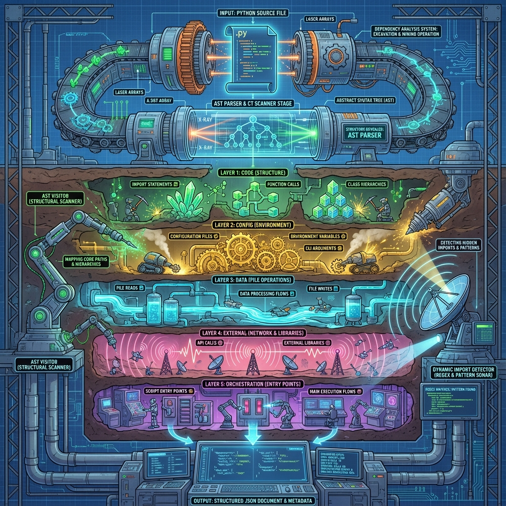

# analyze_dependencies.py — Workflow Visualization

This directory contains visual documentation for the `analyze_dependencies.py` script.

## Files

### 1. `analyze_dependencies_workflow.mmd`
Mermaid diagram showing the complete data flow through the 5-layer dependency analysis system.

**Layers visualized:**
- 📥 **INPUT**: Python source files
- 🔬 **AST PARSING**: Source code → Abstract Syntax Tree
- 🔍 **ANALYSIS ENGINES**: 
  - `DependencyAnalyzer` (AST Visitor)
  - `DynamicImportDetector` (Regex Engine)
- 📦 **LAYER 1 - CODE**: Imports, function calls, class hierarchy, decorators, exports
- ⚙️ **LAYER 2 - CONFIG**: Config files, environment vars, CLI arguments
- 💾 **LAYER 3 - DATA**: File reads/writes, data transforms
- 🌐 **LAYER 4 - EXTERNAL**: API calls, external libraries, subprocess
- 🎭 **LAYER 5 - ORCHESTRATION**: Entry points, script calls
- 📊 **METADATA**: Statistics and version info
- 📤 **OUTPUT**: JSON dependency files + logs

**View the diagram:**
```bash
# Using mermaid CLI
mmdc -i analyze_dependencies_workflow.mmd -o workflow.png

# Or view in any Mermaid-compatible viewer
```

### 2. `analyze_dependencies_visual.png`
AI-generated visual metaphor showing the dependency analysis process as a sophisticated "archaeological excavation" or "code mining operation".

**Visual elements:**
- **Top**: Python file being fed into analysis machine
- **Scanner**: AST parser as X-ray/CT scanner
- **Five excavation layers** (color-coded):
  - 🟢 Green: CODE layer (imports, functions, classes as crystals)
  - 🟡 Yellow: CONFIG layer (settings as golden gears)
  - 🔵 Cyan: DATA layer (file operations as flowing streams)
  - 🔴 Pink: EXTERNAL layer (API calls as radio waves)
  - 🟣 Purple: ORCHESTRATION layer (entry points as control panels)
- **Analysis engines**:
  - Robotic arm: AST Visitor
  - Radar system: Dynamic Import Detector
- **Bottom**: JSON output with statistics screens

**Purpose**: Provides an intuitive, metaphorical understanding of the multi-layered dependency extraction process.

## Usage in Documentation

### In Markdown
```markdown
## Workflow Diagram


## Technical Flow
\`\`\`mermaid
graph TB
    ... (paste mmd content)
\`\`\`
```

### In Presentations
Use `analyze_dependencies_visual.png` for high-level explanations and `analyze_dependencies_workflow.mmd` (rendered) for technical details.

## Related Files
- `analyze_dependencies.py` — Main script
- `analyze_dependencies.pseudo.md` — Pseudocode documentation
- `docs/specs/Automation_Tools_Spec.md` — Specification
- `docs/developer_diary/20251212_analyze_dependencies_audit_fixes.md` — Development log
