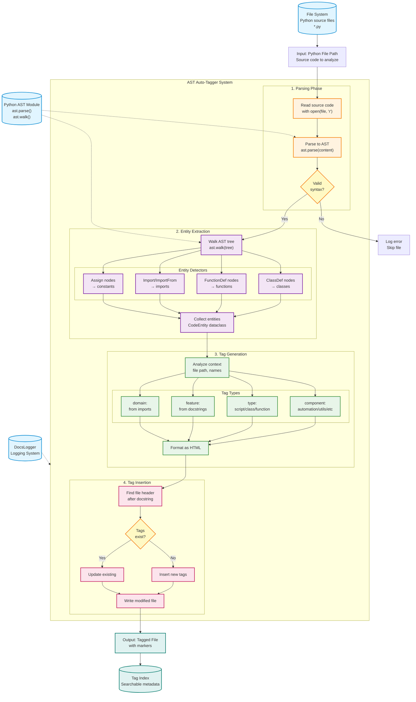

# AST Auto-Tagger Architecture

**Component**: `docs/automation/ast_auto_tagger.py`  
**Purpose**: Automatic semantic tag generation for Python files  
**Date**: 2025-12-13

---

## Overview

AST Auto-Tagger analyzes Python source code using Abstract Syntax Trees (AST) to automatically generate semantic tags. These tags enable powerful search and navigation capabilities across the codebase.

---

## Architecture Diagram



---

## Visual Metaphor


The visualization shows:
- **Left**: Python source files being read
- **Center-Left**: Code transformed into AST tree (roots=imports, trunk=classes, branches=functions)
- **Center**: Four parallel detection streams (classes, functions, imports, constants) converging into CodeEntity collector
- **Center-Right**: Tag generation (component, type, feature, domain tags) formatted as HTML comments
- **Right**: Tag insertion with decision point, final tagged file, and searchable tag index

---

## Dependencies

### Python Standard Library
| Module | Usage |
|--------|-------|
| `ast` | Parse Python code into Abstract Syntax Tree |
| `pathlib` | File path handling |
| `dataclasses` | CodeEntity data structure |

### Internal Modules
| Module | Usage |
|--------|-------|
| `docs.utils.docs_logger` | Logging system |

---

## Data Structures

### CodeEntity

```python
@dataclass
class CodeEntity:
    """Represents a code entity found in the AST."""
    entity_type: str  # 'class', 'function', 'import', 'constant'
    name: str
    line_number: int
    docstring: Optional[str]
    decorators: List[str]
    parent: Optional[str]  # For nested entities
```

---

## Processing Pipeline

### Phase 1: Parsing

**Input**: Python file path  
**Process**:
1. Read source code from file
2. Parse using `ast.parse(content)`
3. Validate syntax

**Output**: AST tree or error

### Phase 2: Entity Extraction

**Input**: AST tree  
**Process**:
1. Walk tree using `ast.walk(tree)`
2. Detect entities:
   - `ast.ClassDef` → classes
   - `ast.FunctionDef` → functions
   - `ast.Import`, `ast.ImportFrom` → imports
   - `ast.Assign` → constants
3. Extract metadata (name, line number, docstring, decorators)

**Output**: List of CodeEntity objects

### Phase 3: Tag Generation

**Input**: List of CodeEntity objects  
**Process**:
1. Analyze file path → `component:` tag
2. Analyze entity types → `type:` tag
3. Extract from docstrings → `feature:` tag
4. Analyze imports → `domain:` tag
5. Format as HTML comments: `<!--TAG:name-->`

**Output**: List of tag strings

### Phase 4: Tag Insertion

**Input**: Tag strings, original file  
**Process**:
1. Find file header (after docstring)
2. Check if tags already exist
3. Insert new tags or update existing
4. Write modified file

**Output**: Tagged Python file

---

## Tag Types

### Component Tags
Derived from file path:
```python
<!--TAG:component:automation-->
<!--TAG:component:utils-->
<!--TAG:component:processing-->
```

### Type Tags
Derived from entity types:
```python
<!--TAG:type:script-->
<!--TAG:type:class-->
<!--TAG:type:function-->
```

### Feature Tags
Extracted from docstrings:
```python
<!--TAG:feature:memory-->
<!--TAG:feature:embeddings-->
<!--TAG:feature:search-->
```

### Domain Tags
Derived from imports:
```python
<!--TAG:domain:nlp-->
<!--TAG:domain:database-->
<!--TAG:domain:api-->
```

---

## Example Workflow

### Input File

```python
"""
MyScript - Does something useful

PURPOSE: Processes data
"""

import numpy as np
from typing import List

class DataProcessor:
    """Processes data efficiently."""
    
    def process(self, data: List[float]) -> np.ndarray:
        """Process the data."""
        return np.array(data)
```

### AST Analysis

```
Module
├── Import (numpy)
├── ImportFrom (typing.List)
└── ClassDef (DataProcessor)
    └── FunctionDef (process)
```

### Generated Tags

```python
<!--TAG:component:utils-->
<!--TAG:type:class-->
<!--TAG:feature:data_processing-->
<!--TAG:domain:numpy-->
```

### Output File

```python
"""
MyScript - Does something useful

PURPOSE: Processes data

TAGS:
    <!--TAG:component:utils-->
    <!--TAG:type:class-->
    <!--TAG:feature:data_processing-->
    <!--TAG:domain:numpy-->
"""

import numpy as np
from typing import List

class DataProcessor:
    """Processes data efficiently."""
    
    def process(self, data: List[float]) -> np.ndarray:
        """Process the data."""
        return np.array(data)
```

---

## Usage

### Command Line

```bash
# Tag single file
python3 ast_auto_tagger.py --file path/to/script.py

# Tag directory
python3 ast_auto_tagger.py --dir path/to/directory

# Dry run (no file modification)
python3 ast_auto_tagger.py --dir path/to/directory --dry-run
```

### Programmatic

```python
from docs.automation.ast_auto_tagger import ASTAutoTagger

tagger = ASTAutoTagger()
tags = tagger.generate_tags('path/to/file.py')
tagger.insert_tags('path/to/file.py', tags)
```

---

## Integration Points

### Used By
- `docs/automation/search_by_tag.py` - Search files by tags
- `docs/automation/index_project.py` - Build tag index

### Enables
- Semantic code search
- Component discovery
- Dependency analysis
- Documentation generation

---

## Performance

| Metric | Value |
|--------|-------|
| **Files/second** | ~50 files |
| **Average file size** | 500 lines |
| **Tag generation time** | ~20ms per file |

---

## Error Handling

| Error Type | Handling |
|------------|----------|
| Syntax error | Log warning, skip file |
| File not found | Log error, continue |
| Permission denied | Log error, continue |
| Invalid AST | Log warning, skip file |

---

## Future Improvements

1. **ML-based tag suggestion**
   - Use LLM to suggest additional tags
   - Analyze code semantics beyond AST

2. **Tag validation**
   - Ensure tag consistency across project
   - Detect duplicate/conflicting tags

3. **Tag inheritance**
   - Child classes inherit parent tags
   - Nested functions inherit module tags

4. **Performance optimization**
   - Parallel file processing
   - Incremental tagging (only changed files)
