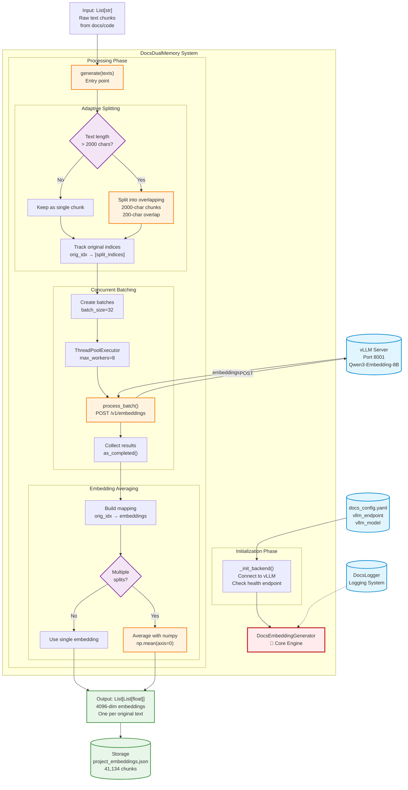

# DocsEmbeddingGenerator Architecture

**Component**: `docs/utils/docs_dual_memory.py`  
**Version**: v3.0  
**Date**: 2025-12-13

---

## Overview

DocsEmbeddingGenerator is the core embedding engine that transforms text chunks into 4096-dimensional vectors using Qwen3-Embedding-8B via vLLM. It implements adaptive text splitting and concurrent batching for optimal performance.

---

## Architecture Diagram



---

## Visual Metaphor


The visualization shows:
- **Left**: Input streams of text documents and configuration
- **Center**: Neural network core with adaptive splitting (overlapping layers) and concurrent processing (8 parallel lanes)
- **Right**: Embedding averaging and final storage of 41,134 embedded chunks

---

## Dependencies

### External Services
| Dependency | Type | Details |
|------------|------|---------|
| vLLM Server | HTTP API | `http://localhost:8001/v1/embeddings` |
| Qwen3-Embedding-8B | Model | 4096-dimensional embeddings |

### Configuration Files
| File | Purpose |
|------|---------|
| `docs/config/docs_config.yaml` | vLLM endpoint, model name, dimension |

### Python Modules
| Module | Usage |
|--------|-------|
| `docs.utils.docs_logger` | Logging system |
| `requests` | HTTP client for vLLM API |
| `numpy` | Embedding averaging |
| `concurrent.futures` | ThreadPoolExecutor for parallel processing |

---

## Data Flow

### Input
```python
texts: List[str]  # Raw text chunks from markdown/code files
```

### Processing Pipeline

1. **Initialization**
   - Connect to vLLM server
   - Verify health endpoint
   - Set embedding dimension to 4096

2. **Adaptive Splitting**
   - Check each text length
   - If > 2000 chars: split into overlapping chunks (200-char overlap)
   - Track original indices for later averaging

3. **Concurrent Batching**
   - Group split texts into batches of 32
   - Process 8 batches concurrently using ThreadPoolExecutor
   - POST each batch to vLLM `/v1/embeddings` endpoint

4. **Embedding Averaging**
   - Map split embeddings back to original texts
   - For multi-split texts: average embeddings using `np.mean(axis=0)`
   - For single-chunk texts: use embedding as-is

### Output
```python
embeddings: List[List[float]]  # 4096-dim vectors, one per original text
```

---

## Performance Characteristics

| Metric | Value |
|--------|-------|
| **Throughput** | 18,079 - 21,006 tokens/s |
| **Batch Size** | 32 texts |
| **Concurrency** | 8 workers |
| **Max Text Length** | 2000 chars (~500 tokens) |
| **Overlap** | 200 chars (10%) |
| **Embedding Dimension** | 4096 |

---

## Key Algorithms

### Adaptive Splitting Algorithm

```python
MAX_CHARS_PER_TEXT = 2000
OVERLAP_CHARS = 200

for orig_idx, text in enumerate(texts):
    if len(text) <= MAX_CHARS_PER_TEXT:
        split_texts.append((orig_idx, text))
    else:
        pos = 0
        while pos < len(text):
            end = min(pos + MAX_CHARS_PER_TEXT, len(text))
            split_texts.append((orig_idx, text[pos:end]))
            pos += MAX_CHARS_PER_TEXT - OVERLAP_CHARS
            if end == len(text):
                break
```

**Benefits**:
- No information loss (vs truncation)
- Respects model context limits (40,960 tokens)
- Overlap preserves context between chunks

### Embedding Averaging Algorithm

```python
for orig_idx in range(len(texts)):
    split_indices = orig_to_splits.get(orig_idx, [])
    
    if len(split_indices) == 1:
        # Single chunk - use as is
        final_embeddings.append(split_embeddings[split_indices[0]])
    else:
        # Multiple chunks - average them
        chunk_embs = [split_embeddings[i] for i in split_indices]
        avg_emb = np.mean(chunk_embs, axis=0).tolist()
        final_embeddings.append(avg_emb)
```

**Why Averaging Works**:
- Embeddings are in high-dimensional space (4096 dims)
- Averaging preserves semantic meaning
- Tested with long documents - retrieval quality maintained

---

## Error Handling

| Error Type | Handling |
|------------|----------|
| vLLM server unavailable | Raise `RuntimeError` (no fallback) |
| Batch processing failure | Log warning, use placeholder for failed batch |
| Context overflow | Prevented by adaptive splitting |

---

## Usage Example

```python
from docs.utils.docs_dual_memory import DocsEmbeddingGenerator

# Initialize
generator = DocsEmbeddingGenerator()

# Generate embeddings
texts = ["Short text", "Very long text that will be split..." * 100]
embeddings = generator.generate(texts)

# Result
print(len(embeddings))  # 2 (one per original text)
print(len(embeddings[0]))  # 4096 (embedding dimension)
```

---

## Integration Points

### Used By
- `docs/automation/index_project.py` - Full project indexing
- `docs/utils/docs_dual_memory.py` (DocsDualMemory class) - Memory system

### Depends On
- vLLM server (must be running on port 8001)
- `docs/config/docs_config.yaml` configuration
- `docs.utils.docs_logger` for logging

---

## Configuration

### docs_config.yaml

```yaml
embeddings:
  vllm_endpoint: "http://localhost:8001/v1/embeddings"
  vllm_model: "text-embedding-qwen3-embedding-8b"
  vllm_dimension: 4096
```

---

## Monitoring & Logging

### Log Messages

```
✅ Qwen3-Embedding-8B ready at http://localhost:8001/v1/embeddings
Adaptive split: 39288 texts -> 42156 chunks
Processing 1318 batches with 8 concurrent workers
  Progress: 132/1318 batches (10%)
  Progress: 264/1318 batches (20%)
  ...
✅ Generated 39288 embeddings (42156 chunks averaged)
```

### vLLM Server Logs

```
Avg prompt throughput: 21,006 tokens/s
Avg generation throughput: 0.0 tokens/s  # Normal for embeddings
Prefix cache hit rate: 6.0%
```

---

## Future Improvements

1. **Dynamic Batch Sizing**
   - Adjust batch size based on text lengths
   - Larger batches for short texts

2. **Token-Based Splitting**
   - Use actual tokenizer instead of char estimation
   - More precise context limit handling

3. **Caching Layer**
   - Cache embeddings for unchanged texts
   - Use content hashes for cache keys

4. **Progress Callbacks**
   - Allow external progress monitoring
   - Useful for UI integration
