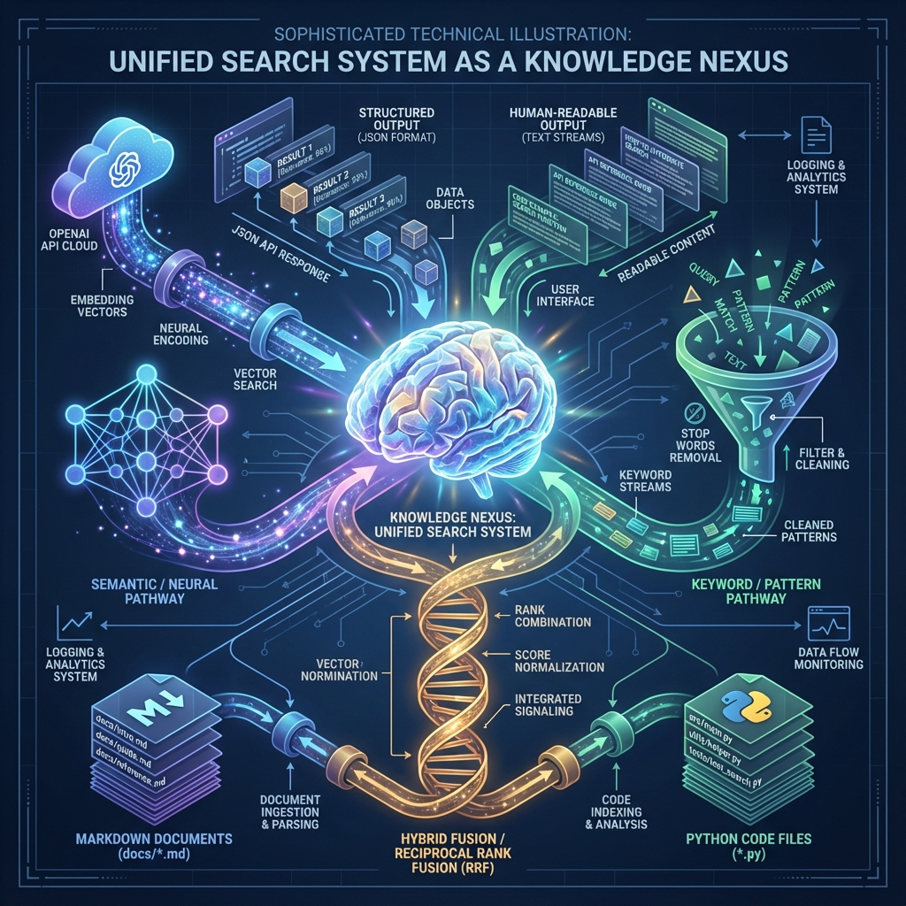

# Semantic Search Visualization

This directory contains visual documentation for `semantic_search.py`.

## Files

### 1. `semantic_search.mmd` - Mermaid Flowchart

Comprehensive architecture diagram showing:

- **5 Dependency Layers**:
  - 🌐 External Dependencies (OpenAI API)
  - 💻 Code Dependencies (DocsLogger, DocsDualMemory)
  - ⚙️ Config Dependencies (docs_config.yaml)
  - 📁 Data Dependencies (docs/*.md, project/**/*.py)
  - 🎯 Orchestration (CLI entry point)

- **Core Architecture**:
  - UnifiedSearcher (main interface)
  - SimpleKeywordSearcher (fallback)
  - SearchResult (data structure)

- **Search Modes**:
  - Auto mode (smart selection)
  - Semantic mode (embeddings-based)
  - Keyword mode (pattern matching)
  - Hybrid mode (RRF fusion)

- **Data Flows**:
  - Input sources → Search execution → Results
  - Fallback mechanism (semantic → keyword on error)
  - RRF fusion algorithm for hybrid mode

**View the diagram**:
```bash
# Using Mermaid CLI
mmdc -i semantic_search.mmd -o semantic_search_flowchart.png

# Or view in any Mermaid-compatible viewer
# (GitHub, VS Code with Mermaid extension, etc.)
```

### 2. `semantic_search_architecture.png` - Metaphorical Visualization

AI-generated illustration showing the semantic search system as a "knowledge nexus":

**Visual Elements**:
- **Central Brain**: Crystalline structure representing the unified search core
- **Three Pathways**:
  - Left (Blue/Purple): Semantic search with neural networks and embeddings
  - Right (Green/Teal): Keyword search with pattern matching and filtering
  - Center (Golden/Orange): Hybrid RRF fusion combining both approaches
- **Input Sources**: Markdown docs and Python code files at the bottom
- **Output Streams**: JSON and text results at the top
- **Background**: Technical blueprint with dependency connections

**Purpose**: Provides an intuitive, metaphorical understanding of the system architecture beyond pure technical diagrams.

## How to Use

### For Documentation
Embed in specs, wiki pages, or presentations:
```markdown

```

### For Understanding
1. Start with the metaphorical image to grasp the concept
2. Dive into the Mermaid diagram for technical details
3. Reference the actual code for implementation

## Related Files

- **Implementation**: `semantic_search.py`
- **Pseudocode**: `semantic_search.pseudo.md`
- **Spec**: `../specs/Automation_Tools_Spec.md`
- **Wiki**: `../wiki/09_Documentation_System.md`
- **Dependencies**: `../memory/dependencies/semantic_search_dependencies.json`

## Diagram Legend

### Mermaid Color Coding
- 🔴 Red: External dependencies (APIs)
- 🔵 Blue: Code dependencies (internal modules)
- 🟣 Purple: Config dependencies (YAML files)
- 🟢 Green: Data dependencies (input/output files)
- 🟠 Orange: Core architecture (main classes)
- 🔷 Cyan: Search modes (user-facing options)
- 🟡 Yellow: Execution layer (internal methods)
- ⚫ Gray: Internal processes (helper functions)

### Arrow Types
- Solid (→): Direct dependency or data flow
- Dashed (-.->): Optional or conditional dependency
- Labeled: Specific operation or relationship

## Maintenance

When updating `semantic_search.py`:
1. Update `semantic_search.mmd` if architecture changes
2. Regenerate flowchart PNG if needed
3. Consider regenerating metaphorical image for major redesigns
4. Update this README if new components added

---

**Created**: 2025-12-13  
**Last Updated**: 2025-12-13  
**Maintainer**: NSS-DOCS Automation Team
