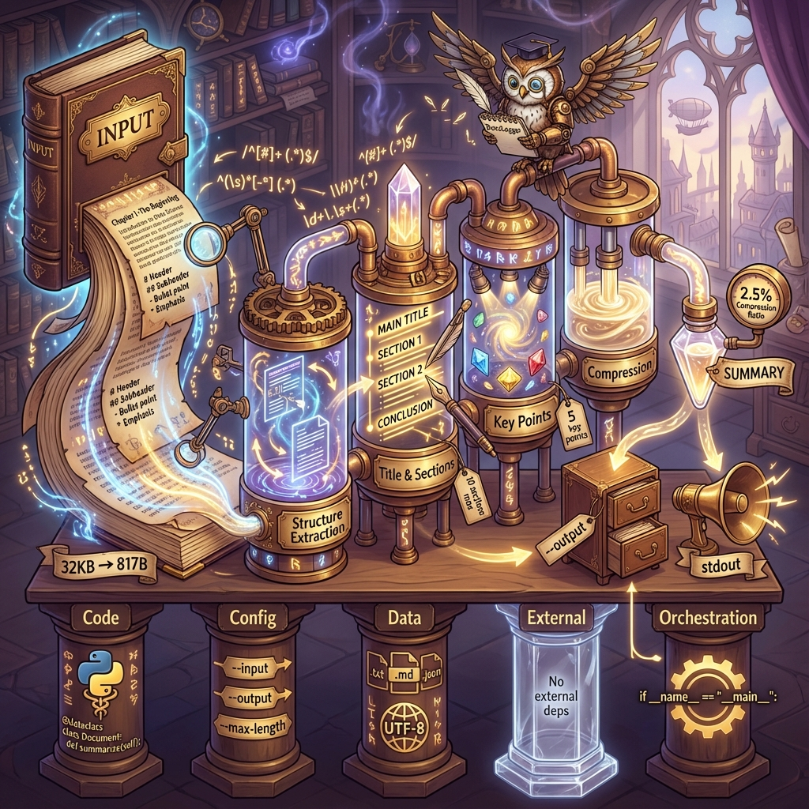

# summarize_docs.py - Visual Documentation

## Overview

This document provides visual representations of the `summarize_docs.py` script:
1. **Technical Flowchart** - Complete data flow with all dependency layers
2. **Metaphorical Visualization** - Conceptual representation of the summarization process

---

## Metaphorical Visualization: Document Distillation



### Concept: The Alchemical Essence Extractor

The visualization represents document summarization as a **mystical distillation process**:

**Left (Input)**: 
- Ancient book with flowing pages containing markdown symbols (#, ##, -, *)
- Represents raw documentation (e.g., 32KB GEMINI.MD)

**Center (Processing Pipeline)**:
- Alchemical apparatus with 4 glass chambers:
  1. **Structure Extraction** - Analyzing document patterns
  2. **Title & Sections** - Highlighting headings in gold
  3. **Key Points** - Crystallizing bullets into gems
  4. **Compression** - Condensing essence to target size
- **DocsLogger Owl** - Wise observer recording the process
- Magical regex runes floating around chambers

**Right (Output)**:
- Crystal vial with concentrated essence (817B summary)
- Compression ratio glowing: **2.5%**
- Two output paths:
  - File cabinet (--output file)
  - Megaphone (stdout)

**Bottom (Foundation)**:
Five pillars representing dependency layers:
1. **Code**: Python, dataclasses, regex
2. **Config**: CLI arguments
3. **Data**: File I/O, UTF-8
4. **External**: Empty (no external APIs)
5. **Orchestration**: __main__ entry point

---

## Technical Flowchart

See [summarize_docs.mmd](./summarize_docs.mmd) for the complete Mermaid diagram.

### Key Components

#### Data Flow
```
Input File → Read → Extract Structure → Build Summary → Compress → Output
```

#### Structure Extraction Algorithm
```
Split Lines → Find Title → Find Sections → Find Key Points → Find Overview → Return Dict
```

#### Summary Building
```
Add Title → Add Overview (200 chars) → Add Sections (10 max) → Add Key Points (5 max) → Join
```

### Dependency Layers (All 5)

| Layer | Type | Components |
|-------|------|------------|
| 1 | Code | DocsLogger, Path, dataclass, argparse, re |
| 2 | Configuration | --input, --output, --max-length |
| 3 | Data | Input file, output file, temp structures |
| 4 | External | None (pure Python) |
| 5 | Orchestration | __main__ entry point |

---

## Usage Examples

### Basic Summarization
```bash
python3 summarize_docs.py --input GEMINI.MD
```

**Result**: 
- Input: 32,487 chars
- Output: 817 chars (stdout)
- Compression: 2.5%

### Save to File
```bash
python3 summarize_docs.py --input docs/wiki/guide.md --output summary.md
```

### Custom Length
```bash
python3 summarize_docs.py --input large_doc.md --max-length 500
```

---

## Algorithm Details

### Structure Extraction

The script extracts 4 key elements:

1. **Title**: First `# Heading` in document
2. **Sections**: All `##` headings with content
3. **Key Points**: Bullet lists (`-` or `*` items > 10 chars)
4. **Overview**: First section if named "Overview", "Introduction", or "Purpose"

### Compression Strategy

- **Title**: Full (if exists)
- **Overview**: First 200 characters + "..."
- **Sections**: Max 10, first sentence or 100 chars each
- **Key Points**: Max 5 bullet points
- **Final**: Truncate to `--max-length` if needed

### Example Transformation

**Input** (GEMINI.MD):
```markdown
# GEMINI.MD — AI Agent System Prompt

## 🎯 CORE PRINCIPLE: Documentation-First Development

Every task must begin and end with documentation...
[32,487 characters total]
```

**Output** (817 chars):
```markdown
# GEMINI.MD — AI Agent System Prompt

## Overview
Every task must begin and end with documentation...

## Sections
### 🎯 CORE PRINCIPLE: Documentation-First Development
**HIGHEST PRIORITY RULE**...
[truncated to 817 characters]
```

---

## Performance Metrics

| Metric | Value |
|--------|-------|
| Compression Ratio | 2.5% (typical) |
| Processing Speed | ~instant for docs <1MB |
| Max Sections | 10 |
| Max Key Points | 5 |
| Default Max Length | 1000 chars |

---

## Related Documentation

- **Implementation**: [summarize_docs.py](./summarize_docs.py)
- **Pseudocode**: [summarize_docs.pseudo.md](./summarize_docs.pseudo.md)
- **Mermaid Diagram**: [summarize_docs.mmd](./summarize_docs.mmd)
- **Audit Report**: See developer diary `20251213_summarize_docs_audit_and_fixes.md`

---

## Visual Design Notes

The metaphorical visualization uses:
- **Steampunk + Magical Library** aesthetic
- **Warm colors** (gold, amber, purple) for processing
- **Glowing streams** for data flow
- **Mystical runes** for technical elements (regex, UTF-8)
- **Isometric perspective** for clarity
- **Five pillars** representing the 5-layer dependency model

This visual metaphor helps understand:
1. Input → Processing → Output flow
2. Multi-stage transformation pipeline
3. Dependency foundation supporting the process
4. Compression/distillation concept
5. Dual output paths (file/stdout)
