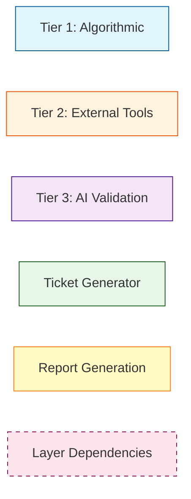

# Validate System Workflow Visualization

**Script**: [`validate_system.py`](validate_system.py)  
**Mermaid Diagram**: [`validate_system.mmd`](validate_system.mmd)  
**Created**: 2025-12-13

---

## 📊 Overview

This visualization documents the complete workflow of the **Adaptive Validation System** - a multi-tier orchestrator that coordinates algorithmic validation, external tools, and AI-based verification with configurable paranoia levels (0-5).

---

## 🎨 Visual Metaphor

The validation system is depicted as a **quality control factory** where code and documentation flow through multiple inspection stations:

### Factory Layout (Left → Right)

1. **Entrance Gate** 🚪
   - Control panel with "PARANOIA LEVEL" dial (0-5)
   - Default setting: Level 5 (Maximum)
   - Two paths: AUTO (level 0) or MANUAL (levels 1-5)

2. **Tier 1 Zone** 🔵 (Blue - Algorithmic)
   - Robotic arm with magnifying glass
   - Conveyor belt with markdown files
   - Screen showing `validate_docs.py` results

3. **Tier 2 Zone** 🟠 (Orange - External Tools)
   - Three parallel stations:
     - **RUFF**: Lint roller cleaning code
     - **MYPY**: Type-checking microscope
     - **MARKDOWNLINT**: Formatting ruler
   - Each has "SKIP if not installed" bypass

4. **Tier 3 Zone** 🟣 (Purple - AI)
   - AI brain in glass chamber
   - Neural network patterns
   - Two input pipes: "Changed Files" / "All Files"
   - Holographic analysis beams

5. **Ticket Generator** 🟢 (Green)
   - 3D printer creating tickets
   - Deduplication filter (MD5 hash)
   - Output box: `docs/technical_debt/tickets/`

6. **Report Center** 🟡 (Yellow)
   - Dual-screen display:
     - Markdown report (✅❌⚠️)
     - JSON data structure
   - Central "ValidationReport" core

7. **Exit Gates** 🚪
   - Red door: EXIT 1 (FAIL/ERROR) ⚠️
   - Green door: EXIT 0 (PASS/WARN) ✅

---

## 🌈 Dependency Layers (Data Streams)

Colored streams flowing through the factory represent the 5 dependency layers:

| Layer | Color | Represents | Examples |
|-------|-------|------------|----------|
| **Layer 1** | 🔵 Blue | Code Dependencies | Python imports, function calls |
| **Layer 2** | 🟡 Yellow | Config Dependencies | CLI arguments, settings |
| **Layer 3** | 🟢 Green | Data Dependencies | File reads/writes |
| **Layer 4** | 🔴 Red | External Dependencies | Tool binaries, API calls |
| **Layer 5** | 🟣 Purple | Orchestration | Subprocess coordination |

---

## 📋 Mermaid Diagram Structure

The [`validate_system.mmd`](validate_system.mmd) flowchart includes:

### Entry & Configuration
- CLI argument parsing (`--paranoia`, `--project-root`)
- Paranoia level selection (0=auto, 1-5=manual)
- Auto-detection based on file count

### Tier 1: Algorithmic Validation
- `Tier1Validator` class
- Runs `validate_docs.py` as subprocess
- Parses markdown output
- **Dependencies**: All 5 layers documented

### Tier 2: External Tools
- `Tier2Validator` class
- Three parallel tools:
  - **ruff**: Python linter (JSON output)
  - **mypy**: Type checker
  - **markdownlint**: Markdown formatter
- Graceful SKIP if tool not installed
- **Dependencies**: Layers 3, 4 documented

### Tier 3: AI Validation
- `Tier3Validator` class
- Runs `local_ai_verifier.py`
- Scope: "changed" or "all" files
- **Dependencies**: All 5 layers documented

### Ticket Generation
- `TicketGenerator` class
- MD5 hash deduplication
- Creates markdown tickets with YAML frontmatter
- Output: `docs/technical_debt/tickets/`

### Report Generation
- `ValidationReport` dataclass
- Dual output: Markdown + JSON
- Status calculation (PASS/WARN/FAIL/ERROR)
- Exit code: 0 (success) or 1 (failure)

---

## 🔍 Key Features Visualized

### Paranoia Levels (0-5)

| Level | Name | Tiers Active | AI Scope | Visual Representation |
|-------|------|--------------|----------|----------------------|
| 0 | Auto | Varies | Varies | Dial auto-adjusts based on file count |
| 1 | Minimal | [1] | None | Only Tier 1 zone lit up |
| 2 | Standard | [1,2] | None | Tiers 1-2 active |
| 3 | Thorough | [1,2,3] | Changed | All tiers, "Changed Files" pipe |
| 4 | Paranoid | [1,2,3] | All | All tiers, "All Files" pipe |
| 5 | Maximum | [1,2,3] | All | All zones + supervisors (DEFAULT) |

### Data Flow Patterns

1. **Sequential Processing**: Files flow through tiers in order
2. **Parallel Execution**: Tier 2 tools run simultaneously
3. **Conditional Branching**: Tools skip if not installed
4. **Aggregation**: Results collected into single report
5. **Deduplication**: Tickets filtered by hash

### Error Handling

- **SKIP**: Tool not installed → bypass route
- **ERROR**: Tool crash/timeout → error flag raised
- **FAIL**: Validation errors found → red warning lights
- **WARN**: Warnings only → yellow caution lights
- **PASS**: All clear → green success lights

---

## 📊 Diagram Legend

### Node Colors (Mermaid)



### Connection Types

- **Solid arrows** (→): Main workflow
- **Dashed arrows** (-.->): Dependency references
- **Decision diamonds** (◇): Conditional logic

---

## 🎯 Use Cases

### 1. Quick Check (Level 1)
```bash
python validate_system.py -p 1
```
**Flow**: Entrance → Tier 1 → Report → Exit

### 2. Standard Validation (Level 2, Default for medium projects)
```bash
python validate_system.py -p 2
```
**Flow**: Entrance → Tier 1 → Tier 2 (all 3 tools) → Report → Exit

### 3. Maximum Validation (Level 5, System Default)
```bash
python validate_system.py
# or explicitly:
python validate_system.py -p 5
```
**Flow**: Entrance → All Tiers → AI (all files) → Tickets → Report → Exit

### 4. Auto-Detection (Level 0)
```bash
python validate_system.py -p 0
```
**Flow**: Entrance → Count Files → Auto-Select Level → Continue

---

## 📁 Related Files

| File | Purpose |
|------|---------|
| [`validate_system.py`](validate_system.py) | Main implementation |
| [`validate_system.pseudo.md`](validate_system.pseudo.md) | Pseudocode documentation |
| [`validate_system.mmd`](validate_system.mmd) | Mermaid flowchart |
| `validate_system_workflow.png` | Visual metaphor illustration |

---

## 🔗 Dependencies Documented

The diagram explicitly shows all 5 dependency layers for each component:

### Example: Tier 1 (validate_docs.py)
- **Layer 1 (Code)**: `validate_docs.py` imports and functions
- **Layer 2 (Config)**: CLI args `--report /dev/stdout`
- **Layer 3 (Data)**: Reads `docs/**/*.md`, writes to stdout
- **Layer 4 (External)**: `subprocess.run` with 60s timeout
- **Layer 5 (Orchestration)**: Called by `Tier1Validator`

### Example: Tier 2 (ruff)
- **Layer 3 (Data)**: Reads `**/*.py`, writes JSON to stdout
- **Layer 4 (External)**: `ruff` binary (pip install ruff)

### Example: Tier 3 (AI Verifier)
- **Layer 1 (Code)**: `utils/local_ai_verifier.py`
- **Layer 2 (Config)**: `--commits 1` if scope=all
- **Layer 3 (Data)**: Reads git diff, writes markdown
- **Layer 4 (External)**: OpenAI API, 300s timeout

---

## 🎨 Visual Design Principles

1. **Left-to-Right Flow**: Matches reading direction
2. **Color Coding**: Each tier has distinct color
3. **Metaphorical Elements**: Factory/quality control theme
4. **Layer Visualization**: Colored streams for dependencies
5. **Status Indicators**: Emoji and colored lights for results

---

## 📝 Notes

- **Default Paranoia Level**: Changed from auto-detect to 5 (maximum) on 2025-12-13
- **Level 0**: Added for explicit auto-detection
- **Ticket Deduplication**: Uses MD5 hash of `file:line:message`
- **Graceful Degradation**: External tools skip if not installed
- **Exit Codes**: 0 for PASS/WARN, 1 for FAIL/ERROR

---


*Multi-tier adaptive validation system visualized as a quality control factory with colored dependency streams.*

---

**Generated**: 2025-12-13  
**Version**: 2.0 (post-paranoia-level-refactoring)
