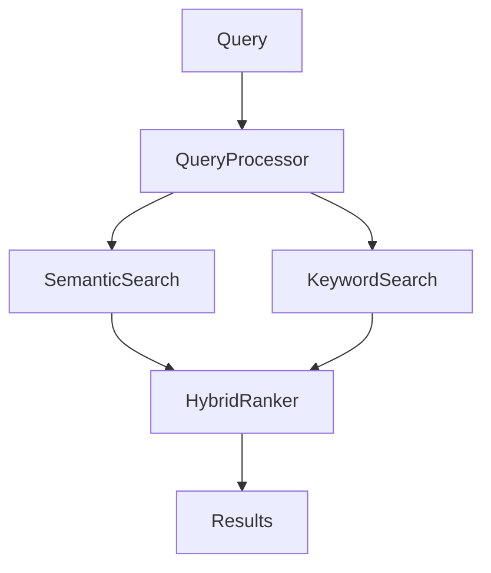

# Agentic System Functions

## Overview

The specialized agentic system performs four key functions that enable the AI-First workflow.

---

## Function 1: Thought Crystallization

**Purpose**: Transform stream of consciousness into structure.

### What It Does
- Converts thought flow into structured layers
- Reveals hidden premises
- Formalizes intentions

### Example

**Input (thought stream)**:
```
Need a search system. Should understand meaning of queries,
not just keywords. Want it fast, even on large data volumes.
And easy to add new data sources.
```

**Output (Layer 2: Vector-Field Format)**:
```
FIELD: Semantic search, RAG pipeline
VECTOR: Hybrid search (semantic + keyword)
HIDDEN: Scalability, extensibility
```

---

## Function 2: Token Connectivity Support

**Purpose**: Ensure semantic continuity between layers.

### What It Does
- Maintains semantic continuity between layers
- Creates vector anchors
- Preserves holographic property of context

### How It Works
```
Layer 1 tokens: "search", "meaning", "fast"
    ↓ [Connectivity maintained]
Layer 4 tokens: "SemanticSearch", "HybridRanker", "QueryProcessor"
    ↓ [Connectivity maintained]
Layer 8 tokens: "def search()", "np.dot()", "index.add()"
```

---

## Function 3: Automation of Routine

**Purpose**: Generate intermediate artifacts automatically.

### What It Does
- Generates tickets from specifications
- Creates diagrams from descriptions
- Forms pseudocode from requirements

### Example Output

**Automatically generated Layer 4 (Architecture)**:


---

## Function 4: Consistency Validation

**Purpose**: Ensure coherence across all layers.

### What It Does
- Verifies code matches specification
- Identifies contradictions between layers
- Ensures holographic property

### Validation Checks
- [ ] Layer 6 ticket covers all Layer 5 requirements
- [ ] Layer 8 code implements all Layer 6 ticket items
- [ ] Tags are consistent across layers
- [ ] No orphaned requirements

---

## With vs Without Agentic System

### Without Agentic System

❌ **Contradiction unresolvable**
- Human must manually create all 8 layers
- Huge cognitive load
- High risk of errors and inconsistency
- Process slow and painful

### With Agentic System

✅ **Contradiction disappears**
- Human works in thought stream mode
- Agentic system structures automatically
- Process fast and natural
- Guaranteed consistency

---

## Philosophy

> The agentic system is not a tool, but a **translator** between human thought stream and machine code structure.

> It allows human to stay human (think freely), and AI to stay AI (work structurally).
