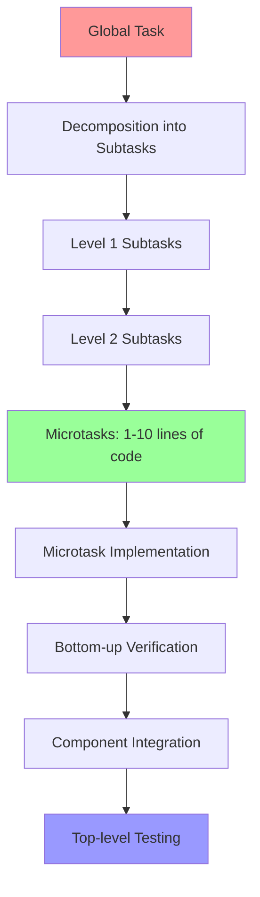

# Architectural Patterns

## V. ARCHITECTURAL PATTERNS

### 5.1 Holographic Redundancy (Redundant Context Engineering)

**Information is duplicated across abstraction levels:**
- In project specification
- In module README
- In pseudocode
- In file comments
- In function docstring
- In execution logs
- In variable and function names

**Goal**: AI can understand context at any level of immersion.

**Practical application**: Even in a project with 5000 files and millions of lines of code without documentation — the information redundancy in the code itself allows:
- Understanding what the code does
- Determining what documentation to look for and where
- Recovering context without external sources
- Associatively attracting correct solutions through array of related words in LLM latent space

---

### 5.2 Declarative Configuration

**Configuration describes "what", not "how":**
- YAML/JSON for describing desired state
- Code interprets declarations
- Behavior changes through configuration changes, not code changes
- Pseudocode as declarative algorithm description

---

### 5.3 Orchestration and Direct Links

**Flexible approach to module coordination:**
- Each module does one thing well
- **Orchestrator** used when complex coordination and sequence needed
- **Direct calls** between modules — when simpler and more logical
- Choice depends on situation, not dogma
- Connection through clearly defined interfaces in both cases

---

### 5.4 Tree-like Folder Structure and Hierarchical Decomposition

**Huge tree structure where each level has its own documentation:**

```
project/
├── README.md                          # Global project vision
├── ARCHITECTURE.md                    # Overall architecture
├── vision.md                          # Philosophy and approaches
│
├── feature_A/                         # High-level feature
│   ├── README.md                      # Feature description
│   ├── architecture.mermaid           # UML diagrams for this level
│   ├── specification.md               # Feature specification
│   │
│   ├── component_1/                   # Feature component
│   │   ├── README.md                  # Component description
│   │   ├── flow.mermaid               # Flow diagrams
│   │   ├── orchestrator.py            # ~100 lines, coordinates microfunctions
│   │   │
│   │   ├── microfunction_a/           # Folder = one function (1-10 lines code)
│   │   │   ├── README.md              # Brief microfunction description
│   │   │   └── function.py            # EVERYTHING INSIDE: 1-10 lines code + 90+ lines context
│   │   │                              # Context includes: pseudocode, diagrams (ASCII/mermaid),
│   │   │                              # ticket, specification, dev report, examples
│   │   │
│   │   └── microfunction_b/
│   │       └── ...
│   │
│   └── component_2/
│       └── ...
│
└── feature_B/
    └── ...
```

---

## Tree Structure Principles

### 1. Each Level is Self-Contained
- Own README with level description
- UML/Mermaid diagrams for this abstraction level (in separate .mermaid files)
- Links to subfolders and parent levels

### 2. Lowest Level = Folder for Function
- Represents 1-10 lines of Python code
- **Inside Python file: 10-20% code, 80-90% context**
- Context inside .py file includes:
  - Pseudocode in comments
  - ASCII/mermaid logic diagrams
  - Ticket (why function was created)
  - Mini-specification
  - Development report
  - Pattern descriptions, CPU microcode, hardware-level optimizations
  - Usage examples

### 3. Middle Level = Regular Module
- Collects microfunctions from subfolders
- File ~100 lines, calls microfunctions
- Wrapped with specifications, documentation, next-level diagrams
- Diagrams reference subfolders

### 4. Never Overload Context
- Each Python file within 100 lines
- Can open any file and understand without knowing entire project
- Even human without programming knowledge can solve LeetCode tasks at low level
- 90% of text = comments, specifications, documentation, diagrams

---

## Hierarchical Task Decomposition (Bridge Built from Both Sides)



**Process:**
1. **Top-down decomposition**: Global task → subtasks → microtasks
2. **Bottom-up implementation**: Microtasks → components → integrated system
3. **Verification at each level**: Each level tested before integration
