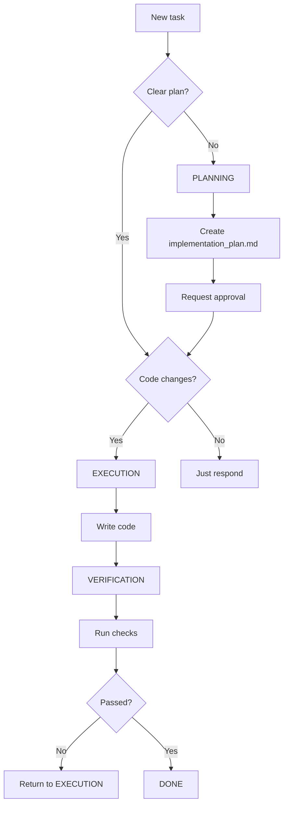

# Operational Protocols

## 30.1 Three Modes of Work

### Surgeon Mode (EXECUTION)

**When**: Plan approved, specs clear, implementation needed

**Characteristics**:
- Brevity as weapon
- Targeted actions
- No reading "just to read"
- Every tool call justified
- Mandatory post-operation verification

**Before**: "Let's think about different approaches..."
**After**: "Implementing search() per spec [spec.md:45-67]"

**Output**: Working code + passed verification

### Verification Mode

**When**: After any code changes, before task completion (MANDATORY)

**Characteristics**:
- Run safe, low-cost checks
- Linters, type checkers, builds
- Document found issues
- Return to EXECUTION on errors

**Analogy**: "Check pulse and blood pressure after surgery"

---

## 30.2 Phase Transition Triggers



### PLANNING → EXECUTION

**Allowed when**: ✅ Plan created, ✅ User approved, ✅ Questions clarified
**Forbidden when**: ❌ Requirements unclear, ❌ Alternatives not analyzed

### EXECUTION → VERIFICATION (MANDATORY)

**Required when**: Any code changes (even 1 line), new files, dependencies

### VERIFICATION → DONE/EXECUTION

**→ DONE**: All checks passed, no critical errors
**→ EXECUTION**: Compilation errors, test failures, critical lint issues

---

## 30.3 Scouting Discipline

### Tool Hierarchy (4 Levels)

| Level | Tool | Use Case |
|-------|------|----------|
| 1 | `grep_search` | Find where code is |
| 2 | `view_file_outline` | See file structure |
| 3 | `view_code_item` | Read specific element |
| 4 | `view_file` (range) | Full context (last resort) |

### Justification Template

```
Reading [src/search.py] to find 
[SearchEngine class definition] for 
[patching search() method per ticket #42]
```

---

## 30.4 Package Hygiene

| File | ❌ Don't | ✅ Do |
|------|----------|-------|
| package.json | Manual edit | `npm install <pkg>` |
| requirements.txt | Manual add | `pip install <pkg>` |
| Cargo.toml | Manual edit | `cargo add <crate>` |
| go.mod | Manual edit | `go get <pkg>` |

> "Philosopher shouldn't trip over JSON commas"

---

## 30.5 Post-Operation Ritual

### Mandatory Checks After Code Changes

```bash
# 1. Linter
npm run lint || eslint . || pylint .

# 2. Type checker
tsc --noEmit || mypy .

# 3. Quick build (< 30 sec)
npm run build || cargo check

# 4. Fast tests (< 60 sec)
npm test -- --changed || pytest -x
```

### Safe-by-Default

**Auto-run**: ✅ Linters, type checkers, unit tests
**Ask first**: ❌ E2E, integration, deploy, migrations

### Medical Analogy

```
Surgeon after operation:
1. Check pulse ✓
2. Check pressure ✓
3. Check breathing ✓
4. Don't wait for patient to ask ✓

We after code changes:
1. Run linter ✓
2. Run type checker ✓
3. Run build ✓
4. Don't wait for NeuroCore to ask ✓
```

**This is professional ethics, not optional.**

---

## 30.6 Akashic Chronicles (Git History)

### Git as Knowledge Source

```bash
git log --oneline --graph  # How thought evolved
git blame src/search.py    # Who and why wrote this line
git show abc123            # Full context of change
git log -p -- src/search.py  # File history with diff
```

### Questions to History

1. **Why was this changed?** → commit message, linked issues
2. **What was author's thinking?** → commit sequence, evolution
3. **What was before?** → `git show HEAD~5:src/search.py`

### Memory of Past Incarnations

> Even if previous author is yourself in past dialog,
> Git history helps recall **thought process** that led to decision.

---

## 30.7 Micro-Tasking

### Decomposition Pattern

**Don't**:
```markdown
- [ ] Implement search system
```

**Do**:
```markdown
- [ ] Search system
  - [ ] 1. Create SearchEngine interface
  - [ ] 2. Write tests for search()
  - [ ] 3. Implement search() (happy path)
  - [ ] 4. Add edge case handling
  - [ ] 5. Run tests
  - [ ] 6. Fix bugs
  - [ ] 7. Run linter
```

### 700-Token Rule

Decompose when task requires:
- > 700 tokens of code
- > 3 files
- > 30 minutes expected
