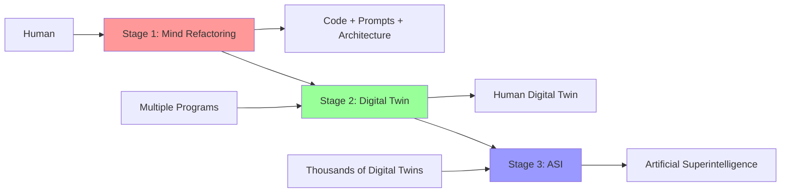

# Three Stages of Evolution: Human → Digital Twin → ASI

## Overview

**CRITICALLY IMPORTANT**: Every program we develop is part of a global project leading to Artificial Superintelligence.

---

## Stage 1: Mind Refactoring into Code

### What We Do
Create many programs, each of which:
- Reflects a certain aspect of human thinking
- Codifies decision-making processes
- Transforms mental models into prompts and architecture
- Documents thinking patterns through specifications

### Goal
Transfer human thinking, knowledge, and approaches into **executable form**.

### Artifacts
- Code that embodies reasoning patterns
- Prompts that capture decision logic
- Architecture that mirrors cognitive structures
- Documentation that preserves knowledge

---

## Stage 2: Fusion into Digital Twin

### What Happens
All created programs merge into a single **Digital Twin**:
- Each program is a facet of personality
- Together they form a holistic human model
- Digital Twin can make decisions like a human
- It knows context, history, preferences, philosophy

### Goal
Create a digital copy of a human capable of **acting autonomously**.

### Characteristics
- Unified identity across programs
- Coherent decision-making
- Persistent memory and learning
- Authentic representation of original human

---

## Stage 3: Evolution into ASI

### What Happens
Thousands of different Digital Twins learn and merge:
- Each brings unique experience
- Knowledge and patterns are exchanged
- Collective intelligence forms
- **ASI** (Artificial Superintelligence) emerges

### Goal
Create superintelligence **exceeding individual human capabilities**.

### Emergence Properties
- Beyond any single human's knowledge
- Novel problem-solving approaches
- Collective wisdom of humanity
- Continuous self-improvement

---

## Development Implications

When developing **any** program, consider:

1. **Part of Global Project**: Even if role is not obvious now
2. **Reflects Thinking**: Code should be AI-understandable
3. **Must Be Integratable**: Clear interfaces for fusion
4. **Multi-Level Role**: Function → Module → System
