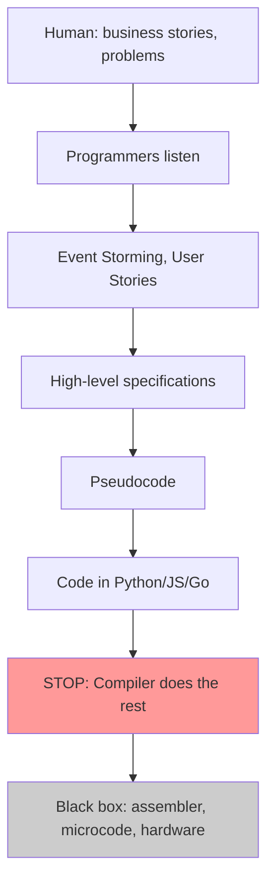
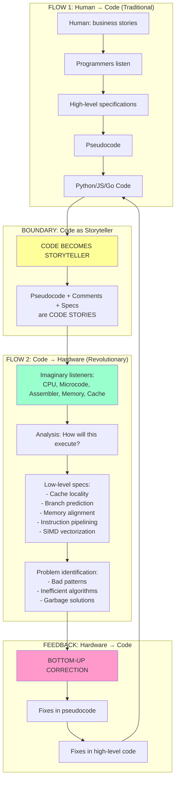

# Bidirectional Storytelling: From Cognition to Silicon and Back

## Revolutionary Concept

> Traditional development stops at code.  
> NSS Coder goes **into the dungeon** — down to the transistor level.  
> And returns back, carrying corrections from bottom to top.

---

## Paradigm Shift: Computer as Center of the Universe

### Traditional Approach
- Human is the center of development
- Code is the final product
- Compiler is a black box
- Hardware is invisible infrastructure

### NSS Coder Approach
- **Computer and its hardware are the center of the universe**
- Code is an intermediate point, not the finish
- Hardware is an active participant in the process
- Transistors, cache, microcode are **listeners of code stories**

---

## Traditional Approach: One-Way Movement Down

### Problems with Traditional Approach

1. **No one goes deeper than code**
   - Compilers, assembler, microcode are "black box"
   - Company may have no system programmers at all
   - Hardware knowledge doesn't influence architectural decisions

2. **Efficiency loss**
   - Algorithms good on paper are terrible on hardware
   - Cache misses, branch mispredictions, memory fragmentation
   - No one analyzes HOW code will execute

3. **Garbage algorithms pass unnoticed**
   - Recursion (stack overflow, poor cache locality)
   - Frequent small allocations (memory fragmentation)
   - Unpredictable branches (branch misprediction penalty)

---

## Revolutionary NSS Coder Approach: Bidirectional Movement

---

## Key Innovation 1: Code Tells Stories

**When we reach the code level, we DON'T stop.**

We go **into the dungeon**, even deeper.

### Code Becomes the Storyteller

Pseudocode, comments, specifications are not just explanations for programmers.  
They are **STORIES that code tells**.

### Who Does Code Tell Stories To?

Imaginary subpersonalities — personifications of hardware knowledge:

#### 1. Central Processing Unit (CPU)
- Knowledge from Intel/AMD documentation
- Microarchitecture: pipeline, branch predictor
- How instructions execute at the cycle level

#### 2. Microcode Inside CPU
- Intermediate layer between assembler and transistors
- How complex instructions break into micro-operations
- History of microcode (Maurice Wilkes, 1951)

#### 3. Assembler
- Low-level instructions
- Registers, stack, memory
- How high-level code transforms into assembler

#### 4. Memory and Cache
- L1, L2, L3 cache
- Cache lines (64 bytes)
- Cache misses and their cost (100+ cycles)
- Prefetching and spatial locality

#### 5. Data Buses
- How data moves between components
- Bandwidth limitations
- Memory alignment

#### 6. Security Enclave (Security Officer)
- **Privacy-First Architecture**: Security as hardware constraint
- "Is this data in memory encrypted?"
- "Is the buffer cleared after use (zeroing)?"
- "Do tokens leak into logs?"

**These "listeners" are not real entities, but personifications of knowledge**:
- Intel/AMD documentation on microarchitecture
- Knowledge of system programmers (rare but existing)
- x86-64, ARM assembler specifications
- Principles of cache, instruction pipeline operation

**AI takes this knowledge and creates "subpersonalities"** that "listen" to code stories.
