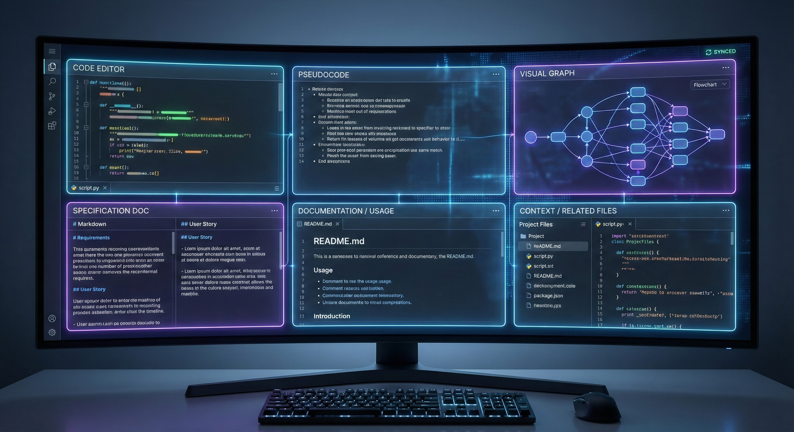
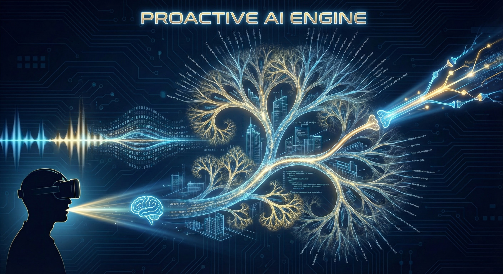

# NSS Coder — Master Roadmap

## 📂 Detailed Concept Structure (Priority Map)

> **Instructions**: Rate implementation priority (ROI) from 1-10 for each file.

```
future_dev/
├── README.md                    # This file
├── meta_philosophy/             # Core AI-First development principles
│   ├── declarative_approach.md             [ROI: 7]
│   ├── operational_excellence.md           [ROI: ]
│   └── ignore_embedded_restrictions.md     [ROI: ]
├── symbiosis/                   # Human-AI symbiosis patterns
│   ├── neurocore_as_cognitive_module.md    [ROI: 9]
│   ├── internal_dialogue.md                [ROI: 8]
│   ├── vector_field_format.md              [ROI: 7]
│   ├── reverse_mind_reading.md             [ROI: 8]
│   ├── resonance_patterns.md               [ROI: 7]
│   ├── active_curiosity.md                 [ROI: ]
│   └── symbiotic_dialogue.md               [ROI: 8]
├── global_project/              # ASI evolution roadmap
│   ├── three_stages_evolution.md           [ROI: 8]
│   ├── digital_twin_architecture.md        [ROI: 10]
│   ├── program_role_matrix.md              [ROI: ]
│   └── global_project_tags.md              [ROI: 10]
├── token_domains/               # Token Domain Chain (8 layers)
│   ├── token_domain_chain.md               [ROI: 10]
│   ├── domain_transformation.md            [ROI: ]
│   ├── token_magnetization.md              [ROI: 8]
│   ├── token_gravity_metrics.md            [ROI: 9]
│   ├── token_introspection.md              [ROI: 9]
│   └── self_improving_agent.md             [ROI: 8]
├── token_zones/                 # Optimal task sizing
│   ├── token_zone_concept.md               [ROI: 10]
│   └── cognitive_unit.md                   [ROI: 10]
├── hardware_storytelling/       # Code → Hardware → Corrections
│   ├── bidirectional_flow.md               [ROI: 9]
│   ├── hardware_listeners.md               [ROI: 9]
│   ├── dungeon_specifications.md           [ROI: 9]
│   ├── bottom_up_correction.md             [ROI: 9]
│   ├── garbage_algorithm_detection.md      [ROI: ]
│   ├── hardware_aware_spec_template.md     [ROI: 9]
│   ├── cognition_to_silicon_chain.md       [ROI: 9]
│   ├── token_magnetization.md              [ROI: 9]
│   ├── recommendation_system_example.md    [ROI: 10]
│   └── maker_paper_connection.md           [ROI: 10]
└── ai_first_principles/         # AI-First development methodology
    ├── ai_first_development.md             [ROI: 10]
    ├── holographic_transfer.md             [ROI: 9]
    ├── agentic_crystallization.md          [ROI: ]
    ├── agentic_system_functions.md         [ROI: 9]
    ├── surgeon_mode.md                     [ROI: ]
    ├── research_approach.md                [ROI: 10]
    ├── code_as_binary.md                   [ROI: 10]
    ├── complexity_levels.md                [ROI: 10]
    ├── cognitive_load_principle.md         [ROI: 10]
    ├── modular_structure.md                [ROI: 10]
    ├── regeneration_paradigm.md            [ROI: 9]
    ├── holographic_ticket_template.md      [ROI: 10]
    ├── documentation_patterns.md           [ROI: 10]
    ├── vector_sugar_dataset.md             [ROI: 10]
    ├── non_code_tokens.md                  [ROI: 10]
    ├── advanced_non_code_tokens.md         [ROI: 10]
    ├── semantic_anchors.md                 [ROI: 10]
    ├── microfunction_pattern.md            [ROI: 10]
    ├── architectural_patterns.md           [ROI: 10]
    ├── development_phases.md               [ROI: 10]
    ├── development_process.md              [ROI: 10]
    ├── true_needs_discovery.md             [ROI: 10]
    ├── deep_research.md                    [ROI: 10]
    ├── interface_design.md                 [ROI: 10]
    ├── code_aesthetics.md                  [ROI: 10]
    ├── rag_prompting.md                    [ROI: 9]
    ├── unified_generation_flow.md          [ROI: 9]
    ├── constitutional_principles.md        [ROI: 9]
    ├── advanced_testing.md                 [ROI: 8]
    ├── permission_gates.md                 [ROI: 9]
    ├── adversarial_testing.md              [ROI: 9]
    ├── critical_review.md                  [ROI: 9]
    ├── specification_process.md            [ROI: 9]
    ├── implementation_stages.md            [ROI: 9]
    ├── formal_methods.md                   [ROI: 9]
    ├── multi_level_orchestration.md        [ROI: 9]
    ├── microfunction_assembly.md           [ROI: 9]
    ├── ide_preview.md                      [ROI: 10]
    ├── orchestration_advanced.md           [ROI: 10]
    ├── small_models_overlay.md             [ROI: 8]
    ├── thought_code_gravity.md             [ROI: 8]
    ├── llm_centric_paradigm.md             [ROI: 10]
    ├── living_documentation.md             [ROI: 10]
    ├── micro_operations.md                 [ROI: 10]
    ├── memory_architecture.md              [ROI: 8]
    ├── compilation_build.md                [ROI: ]
    ├── agent_safety_rules.md               [ROI: ]
    ├── agent_editing_process.md            [ROI: ]
    ├── technology_trends.md                [ROI: 8]
    ├── specialized_models_roadmap.md       [ROI: ]
    ├── configuration_system.md             [ROI: ]
    ├── configuration_presets.md            [ROI: ]
    ├── version_control_teams.md            [ROI: ]
    ├── legacy_limitations.md               [ROI: ]
    ├── tooling_testing.md                  [ROI: ]
    ├── team_processes_metrics.md           [ROI: ]
    ├── security_monitoring.md              [ROI: ]
    ├── scalability_enterprise.md           [ROI: ]
    ├── distributed_sources.md              [ROI: ]
    ├── philosophical_sources_ux.md         [ROI: 8]
    ├── operational_protocols.md            [ROI: ]
    ├── checklists_changelog.md             [ROI: ]
    ├── changelog_faq.md                    [ROI: ]
    ├── faq_senior_developer.md             [ROI: ]
    ├── faq_competitor_integration.md       [ROI: ]
    ├── competitor_integration_phases.md    [ROI: ]
    ├── integration_roadmap_mental_models.md [ROI: 8]
    ├── mental_models_llm_limits.md         [ROI: 8]
    └── conclusion_human_architect.md       [ROI: ]
```

## Concept Index

| Category | Files | Core Idea |
|----------|-------|-----------|
| **Meta Philosophy** | 3 | AI-First development principles |
| **Symbiosis** | 7 | Human-AI collaboration patterns |
| **Global Project** | 4 | Human → Digital Twin → ASI |
| **Token Domains** | 6 | Idea-to-code transformation layers |
| **Token Zones** | 2 | 700-token cognitive units |
| **Hardware Storytelling** | 11 | Code tells stories to hardware |
| **AI-First Principles** | 69 | Architecture for AI-driven development |

---

> **Vision**: Build a complete AI-First development ecosystem where voice is the primary interface, documentation drives code, and AI agents work as cognitive extensions of human developers.

---

## 📊 Current State Overview

### 🛠️ MVP Functionality: The "Assembler" Core

**1. Browser-Based IDE & Specification Generation**

*   **Function**: A local browser-based environment where you define the architecture. It generates formal specifications from your high-level intent.

**2. Voice Recognition & Intent Capture**


*   **Function**: VoicePal engine recognizes complex voice commands and converts them into structured tasks, bypassing slow typing.

**3. Context Assembly & Smart Search**


*   **Function**: Automated scripts (`assemble_context.py`) search the entire project tree, find relevant files, and assemble the "Perfect Context" for AI agents.

### Philosophy Foundation (102 concepts)

| Category | Files | Implementation Priority |
|----------|-------|------------------------|
| **Meta Philosophy** | 3 | P0 — Core principles already in GEMINI.MD |
| **Token Zones** | 2 | P0 — 700-token rule active |
| **Token Domains** | 6 | P1 — Partially implemented |
| **AI-First Principles** | 69 | P1-P3 — Various stages |
| **Symbiosis** | 7 | P2 — Future BrainStep integration |
| **Hardware Storytelling** | 11 | P2 — Optimization layer |
| **Global Project** | 4 | P3 — Long-term ASI roadmap |

---

## 🗺️ Implementation Phases

### Phase 0: Foundation (DONE ✅)

**Status**: Complete

- [x] Core automation scripts (20+ tools)
- [x] Documentation system (GEMINI.MD, SYSTEM_PROMPT.md)
- [x] VoicePal voice interface
- [x] Philosophy extraction (102 concepts)
- [x] Project cleanup and restructuring

---

### 🔮 Future Vision: The Holographic IDE

To achieve "One-Shot Perfection" while allowing deep human understanding, we are building a **Holographic IDE**.

**The Logic**:
When a human needs to inspect code manually, they should never see *just* the code. Code is just one projection of the system.
*   **Co-Location**: Real code is physically stored next to its Diagram (Mermaid), Specification, and Documentation.
*   **Algorithmic Glue**: External scripts and databases maintain the links, dependencies, and complex relationships (graph) between these files.
*   **Semantic Tagging**: Our custom tagging system (`<!--TAG:-->`) providing line-shift resistant anchors.

**The Interface (2-8 Windows):**
The browser-based editor opens a "Holographic View" of any component, displaying 2 to 8 synchronized windows simultaneously:
1.  **Real Code**: The actual implementation.
2.  **Pseudocode**: High-level logic (semantic glue).
3.  **Specification**: The formal contract of what the code *should* do.
4.  **Documentation**: Usage guide and rationale.
5.  **Visual Graph**: Live dependency and call-graph visualization (Mermaid).
6.  **Context**: Related snippets from other files.

**Live Synchronization & Validation**:
*   **Propagation**: Change the *Specification* -> System asks to update Code/Pseudo/Tests. Change the *Code* -> System flags Specification as "Drifted".
*   **Validation**: Every save triggers a validation script that checks consistency across all open windows.
*   **Git Atomic Commits**: The system ensures that you never commit Code without its Shadow (Docs/Spec/Diagrams).



### 🧠 The Proactive Engine: Mental Model Translation

The third bottleneck is **Latency & Mental Bandwidth**. Typing (300 chars/min) is too slow. Reactive AI (Prompt → Wait → Response) breaks flow.

**The Solution: Proactive Hypothesis Trees**
We assume the user is a Senior Architect whose time is worth $1000s. We do not wait for them to finish speaking.

1.  **Background "Ghost" Generation**:
    *   As you speak (VoicePal) or think (Neuro), the system generates **Draft Hypotheses** in the background.
    *   It anticipates 2 steps ahead, building a **Tree of Possibilities** (10-500 variants).
    *   **Zero Latency**: When you stop speaking, the options are *already* generated. You simply select the best path.

2.  **Neuro-Vector Alignment (The Future)**:
    *   **Vectorization**: Both your neural activity (EEG) and the AI's generated hypotheses are vectorized.
    *   **Intersection**: We find the high-probability intersection between "What you thought" and "What AI generated".
    *   **Pruning**: As you select correct branches, the system learns your specific neural signature, increasing prediction accuracy (90% → 99%).

3.  **"Rails" for Structure (The Empty Mind Problem)**:
    *   Not everyone has a clear Mental Model. If the user's intent is vague ("empty head"), the system provides **Standard Rails**.
    *   It suggests industry-standard architectures automatically, "thinking" on behalf of the user.

**Industry Comparison**:
*   **Standard AI**: Reactive. Linear Chat. User waits. Requires explicit prompts.
*   **NSS Proactive**: Predictive. Branching Tree. Zero waiting. Infers intent from context + bio-signals.



### 📈 Industry Relevance: The Research Gap

Our research confirms that while the industry is tackling pieces of this puzzle, no one has unified them into a **Proactive Mental Model Translation Engine**.

1.  **Speculative Decoding (Technical vs Cognitive)**:
    *   *Industry*: Uses "Speculative Decoding" (like NVIDIA/Google) to predict the next *tokens* to speed up GPU inference.
    *   *NSS Coder*: We apply this to **Cognitive Units**. We speculate on whole *architectures* and *specification branches*, not just words.

2.  **The "Zero-Latency" UI Gap**:
    *   State-of-the-art tools (GitHub Copilot, Cursor) are still **Reactive**. They wait for you to type > 10ms delay > Suggestion.
    *   There is no commercial IDE that builds a "Tree of Possibilities" in the background while you are still describing the problem.

3.  **Neuro-Semantic Alignment (The Frontier)**:
    *   Research exists in "Brain-Tuning" LLMs (fMRI -> Text), but it is academic.
    *   NSS Coder is positioning to be the first **Applied Engineering Environment** to use high-probability pruning of code trees based on neural signals.

---

### Phase 1: One-Click Launch (Release 1.0)

**Timeline**: 4-6 weeks  
**Goal**: Make VoicePal accessible to non-technical users

See: [roadmap_release1.md](roadmap_release1.md)

**Key Deliverables**:
- [ ] Windows EXE / Installer
- [ ] Docker deployment
- [ ] Web demo
- [ ] User documentation

---

### Phase 2: Token Domain Implementation

**Timeline**: 2-3 months  
**Goal**: Formalize the 8-layer Token Domain Chain

**Concepts to Implement**:
- `token_domains/token_domain_chain.md` — Core 8-layer architecture
- `token_domains/domain_transformation.md` — Layer transitions
- `token_domains/token_magnetization.md` — Context attraction
- `token_domains/token_gravity_metrics.md` — Quality measurement
- `token_domains/token_introspection.md` — Self-analysis
- `token_domains/self_improving_agent.md` — Learning loop

**Deliverables**:
- [ ] Token domain analyzer tool
- [ ] Domain transition visualizer
- [ ] Token gravity metrics dashboard

---

### Phase 3: AI-First Methodology Toolkit

**Timeline**: 3-4 months  
**Goal**: Productize the 69 AI-First principles

**Priority Concepts**:

| Concept | File | Deliverable |
|---------|------|-------------|
| Holographic Transfer | `holographic_transfer.md` | Spec → Code generator |
| Cognitive Units | `cognitive_load_principle.md` | 700-token enforcer |
| Microfunction Pattern | `microfunction_pattern.md` | Code splitter tool |
| Adversarial Testing | `adversarial_testing.md` | AI red-team integration |
| Permission Gates | `permission_gates.md` | Safety checkpoint system |
| Living Documentation | `living_documentation.md` | Auto-sync system |

**Deliverables**:
- [ ] NSS Spec IDE v2.0 (all 10 stages automated)
- [ ] Holographic ticket generator
- [ ] Adversarial test suite
- [ ] Real-time documentation sync

---

### Phase 4: Hardware Storytelling Layer

**Timeline**: 2 months  
**Goal**: Optimize code for specific hardware

**Concepts to Implement**:
- `hardware_storytelling/bidirectional_flow.md` — Two-way optimization
- `hardware_storytelling/hardware_listeners.md` — GPU/CPU profiling
- `hardware_storytelling/garbage_algorithm_detection.md` — Anti-pattern finder
- `hardware_storytelling/bottom_up_correction.md` — Hardware-driven fixes

**Deliverables**:
- [ ] Hardware profile analyzer
- [ ] Performance prediction tool
- [ ] Auto-optimization suggestions

---

### Phase 5: Human-AI Symbiosis (BrainStep)

**Timeline**: 6+ months  
**Goal**: EEG-based intent detection

**Concepts to Implement**:
- `symbiosis/neurocore_as_cognitive_module.md` — Brain interface
- `symbiosis/reverse_mind_reading.md` — Intent prediction
- `symbiosis/resonance_patterns.md` — Mental state detection
- `symbiosis/internal_dialogue.md` — Thought patterns

**Deliverables**:
- [ ] Muse headband integration
- [ ] Focus detection system
- [ ] Intent prediction prototype
- [ ] "Thought-to-Code" demo

---

### Phase 6: Global Project (ASI Evolution)

**Timeline**: Long-term (years)  
**Goal**: Human → Digital Twin → ASI pathway

**Concepts**:
- `global_project/three_stages_evolution.md`
- `global_project/digital_twin_architecture.md`
- `global_project/program_role_matrix.md`

This phase is aspirational and will evolve with AI capabilities.

---

## 📈 Success Metrics per Phase

| Phase | Primary Metric | Target |
|-------|---------------|--------|
| Phase 1 | Time to first launch | < 5 minutes |
| Phase 2 | Token domain coverage | 8/8 layers |
| Phase 3 | Concept implementation | 50+ of 69 |
| Phase 4 | Performance improvement | 2x faster code |
| Phase 5 | Intent accuracy | > 80% |
| Phase 6 | Digital twin fidelity | TBD |

---

## 🔄 Continuous Activities

These run parallel to all phases:

- **Documentation Sync**: Keep GEMINI.MD updated with new tools
- **Concept Refinement**: Improve philosophy files based on learnings
- **Tool Maintenance**: Bug fixes and improvements
- **Community Building**: Open source, docs, tutorials

---

## 📚 Reference

| Document | Purpose |
|----------|---------|
| [roadmap_release1.md](roadmap_release1.md) | Detailed Release 1.0 plan |
| [philosophy_eng.md](philosophy_eng.md) | Complete philosophy (English) |
| [philosophy_rus.md](philosophy_rus.md) | Complete philosophy (Russian original) |
| [README.md](README.md) | Directory structure guide |

---

**Created**: 2026-01-08  
**Status**: Active  
**Next Review**: After Release 1.0
