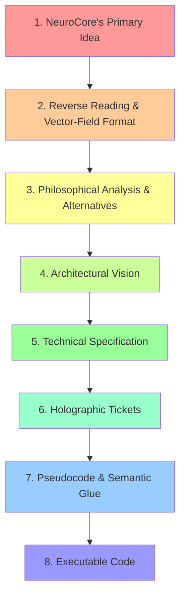

# Token Domain Chain: From Idea to Code

## Overview

For the AI to have **token connectivity** from NeuroCore's primary idea to the final code, the thought must pass through a chain of knowledge domains and token clouds.

Each domain is an abstraction layer with its own semantic field, where tokens are organized in a specific way.

## The Eight Layers



## Layer Summary

| Layer | Name | Token Cloud | Output |
|-------|------|-------------|--------|
| 0 | Artifact Ingestion | File types, patterns | Classification |
| 1 | Primary Idea | Natural language, intentions | Raw concept |
| 2 | Reverse Reading | Reconstructed thought | Field + Vector |
| 3 | Philosophy | Alternatives, justifications | Decision |
| 4 | Architecture | Components, patterns | Design |
| 5 | Specification | Requirements, interfaces | Spec doc |
| 6 | Holographic Ticket | Full context | Self-contained ticket |
| 7 | Pseudocode | Algorithms, explanations | Algorithm + Glue |
| 8 | Executable Code | Python syntax | Working code |

## Token Connectivity Principle

**Key rule**: At each transition between layers, preserve **semantic continuity**.

### Connectivity Mechanisms

1. **Holographic Property**: Each layer contains echoes of previous layers
2. **Semantic Tags**: @TAG links layers through search
3. **Explicit References**: "As described in specification..."
4. **Key Concept Repetition**: Same terms at all levels
5. **Vector Anchors**: Dense clouds of related tokens

## Example Token Evolution

```
Layer 1: "search system"
    ↓
Layer 2: "semantic search", "RAG pipeline", "integration"
    ↓
Layer 3: "Elasticsearch", "Qdrant", "own solution"
    ↓
Layer 4: "HybridSearchEngine", "VectorIndex", "KeywordIndex"
    ↓
Layer 5: "alpha parameter", "semantic similarity", "keyword matching"
    ↓
Layer 6: "@TAG:FEATURE:semantic-search", "hybrid scoring formula"
    ↓
Layer 7: "STEP 1: Validate", "STEP 2: Get semantic results"
    ↓
Layer 8: "def search()", "if not query:", "vector_index.search()"
```

**Note**: Tokens evolve but maintain semantic connection.

## Why Token Connectivity Matters

### Without Connectivity
- AI "forgets" original intention
- Code doesn't match idea
- Context and justifications lost
- Impossible to understand "why this way"

### With Connectivity
- Every code line traces to primary idea
- Full context understanding preserved
- Any layer understandable in isolation
- Resonance created through all layers

> **This is the path from NeuroCore's thought to working code.**
